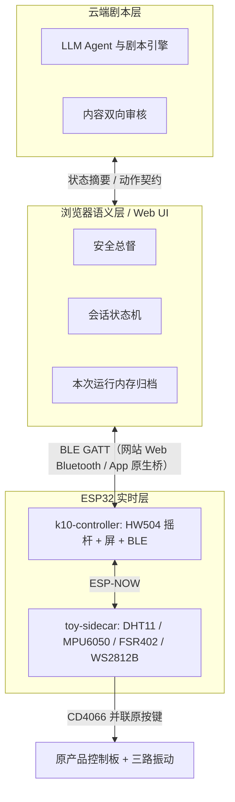

# Nascent

智能情趣按摩玩具的软硬件工程仓库。当前处于**验证期双板 Demo** 阶段。

产品架构（仓库内权威副本）：[`docs/architecture/产品架构.md`](docs/architecture/产品架构.md)。飞书讨论稿：<https://my.feishu.cn/docx/FggRdEmySofDoGx2WzFc77MznCd>（改架构必须同步回仓库）。

## 三层运行架构



职责边界是硬约束，不是建议：

- **云端**只产出台词与剧本推进，永远看不到原始传感器流与音频。
- **浏览器控制端** 是安全总督，在 LLM 之外硬编码封顶、过温拒绝加档、安全词后丢弃一切非 stop 动作。
- **固件**负责实时闭环。安全词、急停拉环、过温熔断、90% 强度封顶**不依赖 App 与网络**。

## 目录

| 目录 | 内容 | 成熟度 |
|---|---|---|
| [`protocol/`](protocol/) | 三端唯一事实来源：契约、生成器、JSON Schema | 已冻结 `0.1.0-demo` |
| [`hardware/k10-controller/`](hardware/k10-controller/) | 行空板 K10：摇杆、屏、BLE Peripheral、ESP-NOW 网关 | 功能完整 |
| [`hardware/toy-sidecar/`](hardware/toy-sidecar/) | 玩具侧 ESP32-S3：传感、入体推断、灯效、CD4066 | 功能完整 |
| [`software/app/`](software/app/) | 浏览器控制端（网站 + PWA） | 框架骨架 |
| [`software/app-android/`](software/app-android/) | 同一套 Web UI 的 Android 壳 | 框架骨架 |
| [`software/backend/`](software/backend/) | FastAPI 后端（同时托管网站） | 框架骨架 |
| [`datasheets/`](datasheets/) | 已选型器件的厂商 datasheet | — |
| [`docs/`](docs/) | 协作与提交规范 | — |
| [`docs/architecture/`](docs/architecture/) | 产品架构（权威副本） | V1.3 已归档 |

## 上手

协作、分支、提交和评审流程见 [`docs/Nascent 开发与代码提交规范.md`](docs/Nascent%20开发与代码提交规范.md)。架构结论写在 [`docs/architecture/产品架构.md`](docs/architecture/产品架构.md)，不要只改飞书。改任何跨端字段之前，先读 [`protocol/README.md`](protocol/README.md)。

```bash
# 协议：改完 contract.yaml 后必须重新生成
cd protocol && python3 tools/gen.py

# 固件（需要 PlatformIO）
cd hardware/toy-sidecar && pio run
cd hardware/k10-controller && pio run

# 后端 + 网站
cd software/backend
python3 -m venv .venv
source .venv/bin/activate          # Windows: .venv\Scripts\activate
pip install -r requirements.txt
uvicorn app.main:app --reload
# 打开 http://127.0.0.1:8000
# Android App：用 Android Studio 打开 software/app-android/，填入同一地址
```

Windows 上开发没有额外步骤：仓库全 ASCII 文件名、`.gitattributes` 锁 LF、
生成器显式 UTF-8 读写。唯一注意的是 venv 激活命令与 macOS/Linux 不同。

## 硬件选型（验证期已锁定）

| 器件 | 接哪块板 | 建议引脚 | 用途 |
|---|---|---|---|
| HW504 摇杆 | K10 | P0/P8/P9 = GPIO1/8/9 | 回中式换档，摇一次一档 |
| DHT11 | 玩具侧 | GPIO4 单总线 | 玩具环境温湿度，**非安全通道** |
| MPU6050 | 玩具侧 | I2C GPIO8/9 @0x68 | 入体状态推断 |
| FSR402 | 玩具侧 | GPIO1 ADC | 贴合与 1–2 Hz 节律 |
| WS2812B ×8 | 玩具侧 | GPIO6 RMT | 模式配色 + 档位颗数 |
| CD4066BE | 玩具侧 | GPIO7 | 并联原按键走原板九档 |

datasheet 与接线摘要见 [`datasheets/README.md`](datasheets/README.md)。

## 第三方依赖

通用驱动一律用社区成熟库，自己只写产品独有逻辑。固件侧的库源码 vendored 在
`hardware/*/lib/`，来源、版本与升级步骤见 [`hardware/VENDOR.md`](hardware/VENDOR.md)。

App 与后端不做 vendored——`pubspec.lock` 和 `requirements.txt` 已经锁了版本，
把源码拷进仓库反而破坏各自的工具链。

## 红线

- **不做医疗器械。** 禁止核心体温、疾病预警、生理周期监测的表述与算法承诺。
  `insert_state` 对外文案一律是「是否在使用中」，不是「插入检测」。
- **不做高潮检测。** 压力只用于贴合与节律。
- **安全功能永不收费。**
- **原始 12 Hz 传感器流与麦克风音频不出设备与 App。** 上云的只有离散枚举摘要。
- **CD4066 不驱动电机。** 它只并联原按键，电机始终由原产品控制板驱动。
- **停机不能远程解除。** 安全词或急停之后，恢复的唯一途径是在 K10 上物理双键确认。
  App 与云端都发不出 `resume`。用户喊过停之后设备自己重新动起来，
  是这个产品最坏的失败模式。
