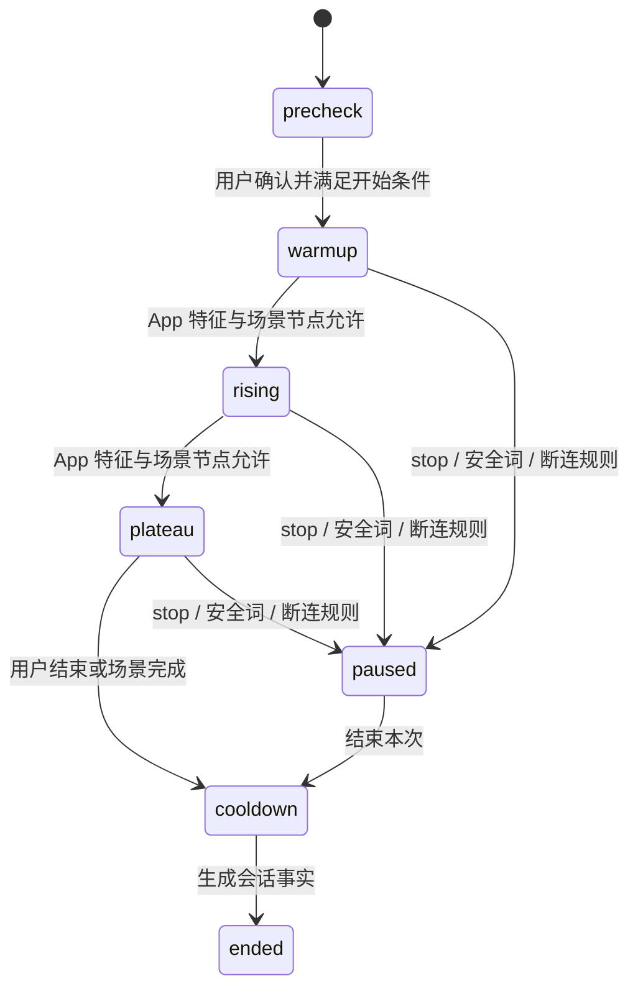
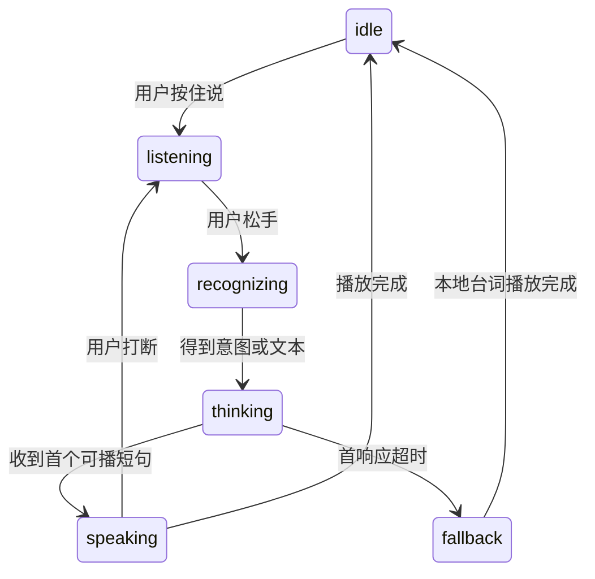
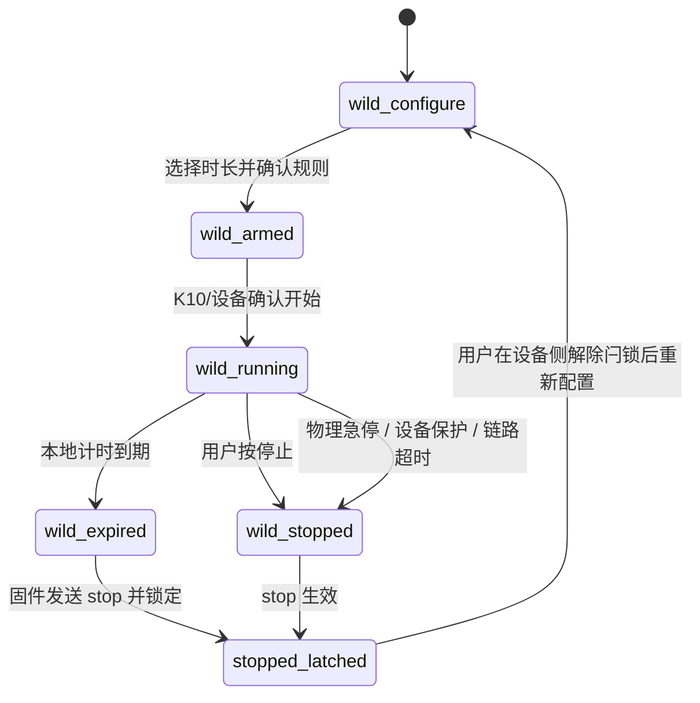
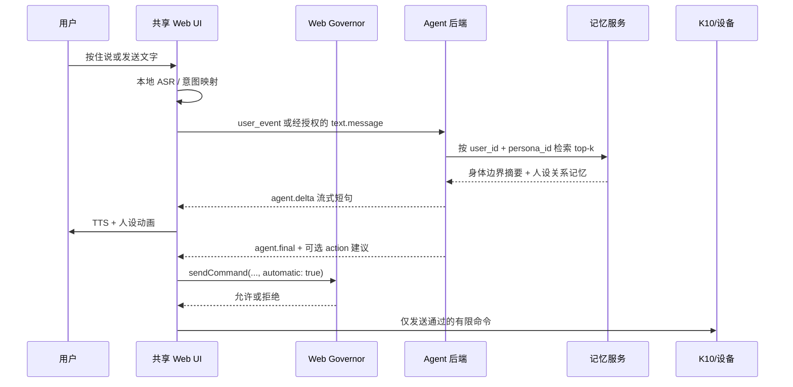

# B 层情景模式技术实现

> 状态：架构已确认；Agent/模板/记忆联调骨架和身体笔记纵向切片已实现，生产持久化与实时语音待实施
> 日期：2026-08-28
> 范围：共享 Web UI + Android WebView 壳的「亲密时刻」B 层、FastAPI Agent、多人设与分层记忆

> 合并说明：本文件是 B 层产品、交互、安全、数据和后端逻辑的主方案；
> [`B层实时Agent与语音方案.md`](B层实时Agent与语音方案.md) 是本文件中 Agent、语音和角色表现部分的实施附录。
> 本轮实时 API 主模型固定为 `Qwen/Qwen3.5-9B`。逻辑别名为 `nascent-chat-9b` 与 `nascent-control-9b`，供应商 ID 为 `Qwen/Qwen3.5-9B`。Prompt 的字段和输出 JSON 以 [`B层Agent提示词契约.md`](B层Agent提示词契约.md) 为准。旧别名 `nascent-realtime-9b` 已废弃。
> 两份文档以本文件的安全边界、失控模式计时规则、数据删除规则为唯一口径。

### 当前实现快照（2026-08-28）

- `software/app/` 已实现身体笔记的三层独立导航：记录列表、单次详情、自我探索对话。
- 单次详情底部固定两个同级入口：`只看这一次` 与 `参考近期记录`；近期范围进入前展示具体日期、模式和数量。
- `software/backend/app/routers/body_notes.py` 已提供记录读取、笔记增删改和 `insight-turn` 联调 API；当前存储为进程内实现，尚未具备账号鉴权和生产持久化。
- Chat 9B 只接收用户明确授权记录的来源标识、数据质量、温感趋势和压力趋势；不接收原始 12 Hz 数组、档位时间线、音频、设备地址或安全词。
- 身体笔记模型输出使用独立严格契约，只允许 `dialogue` 与 `insight_candidate`；控制、Skill、诊断和固定偏好话术会被拒绝并回退到本地安全短句。
- Web UI 的删除在后端可用时必须得到后端成功响应才更新界面；纯静态演示模式只删除本次内存数据，不能冒充云端删除。
- 真实模型请求已具备 OpenAI-compatible HTTP 适配器，但 API 网关、替换后的密钥和模型快照仍需在本地 `.env` 登记后联调，任何密钥不得进入仓库。
- 情境使用回合已提供 `POST /v1/agent/parallel-turn` 双模型并行编排：Chat 与 Control 同时启动、独立超时和独立回退，响应携带可展示的脱敏数据走向；停止链路不经过模型。

## 1. 目标与边界

B 层包含三个并列模块，但本文件重点定义「情境漫游」：

| 模块 | 用户目标 | 本轮技术定位 |
| --- | --- | --- |
| 情境漫游 | 与选定人设进行有节奏的对话式体验，并看到身体数据走向 | 微信式会话主界面、语音输入、数据趋势、场景状态机、多人设和记忆 |
| 我的节奏 | 用户直接决定档位、模式和停止 | 沿用独立控制页；所有设备命令只走 `sendCommand()` 与 `Governor` |
| 身体笔记 | 独立回看每次使用记录、趋势、总结和自己的感受 | 使用记录列表、单次详情、非评判总结，以及“只看这一次 / 参考近期记录”的自我探索对话 |

三个模块共享设备状态和会话身份，但职责不能混合：

- 情境漫游可以给出对话和动作建议，不能直接发 BLE 指令。
- 我的节奏是唯一直接调档的 UI；停止按钮在情境漫游中也必须常驻。
- 身体笔记展示历史，不允许从历史页面恢复设备运行状态。
- 身体笔记中的对话只帮助用户理解记录，不能提出或执行设备动作。
- 人设只决定说什么、怎么说，不决定灯色、档位、安全阈值或停止规则。

### 1.2 双模型并行回合

情境使用页发送一次用户事件时，后端不按“先聊天、再调控”的串行方式等待。`/v1/agent/parallel-turn` 同时启动两条逻辑 lane：

```text
Chat lane
  用户输入 + 当前人设 + 已授权关系记忆
  -> Chat 9B
  -> dialogue / avatar / memory_proposals / skill_proposals

Control lane
  聚合温感趋势 + 聚合压力趋势 + 数据质量 + Skill 白名单
  -> Control 9B
  -> hold / ask / recommend（仍然 action=null）
```

响应中的 `data_flow` 用于在 UI 展示“数据走到哪里”，只包含上述阶段名称，不回传系统 Prompt、原始 12 Hz 采样、完整记忆文本、音频或密钥。编排器分别使用 Chat 8 秒和 Control 2.5 秒的独立 `wait_for`，任一 lane 超时只降级自己：Chat 回退短句，Control 保持当前状态；两者都不能延长失控模式或阻塞 `stop`。Control 建议只有在用户确认、`Governor` 放行并经唯一 `sendCommand()` 入口后才可能成为设备指令。

身体笔记的“了解自己”不是实时设备回合，只走 Chat 9B。它不会为了凑“双模型”而启动 Control 9B，也不会产生 Skill 或档位建议。

### 1.1 模板与硬件 Skill

情境漫游的人设选择分成两类，使用界面和选择界面分开：

1. **预置模板**：由产品审核并随版本发布，例如「轻声陪伴」「慢慢进入」「安静收尾」。用户只能选择和开始，不能直接改写安全字段。
2. **用户自定义模板**：用户可以编辑名称、语气、节奏描述和允许使用的 Skill。自定义模板先保存为草稿，预览并确认后才可使用。

用户可以在“创建自定义模板”的聊天界面里描述想要的体验，Agent 只生成结构化草稿：

```text
用户：我想要前面慢一点，中间保持，最后安静下来
  -> Agent：生成模板草稿 + 可用 Skill 建议
  -> UI：展示节奏、档位范围、时长和数据权限
  -> 用户：确认保存
  -> 后端：保存模板版本
  -> 使用界面：启动模板，Skill 建议仍经 Governor + sendCommand()
```

Skill 是受限能力白名单，不是 Agent 工具权限。第一版只允许声明 `rhythm_segment`、`set_pattern` 和保持现状的 `hold_current`；不能声明 BLE 写入、停止闩锁、恢复、延长失控时间、修改安全阈值或删除数据。设备协议里的 `set_level` 只属于 `sendCommand()`，不是 Agent Skill。Agent 输出的是 `skill_proposal`，执行前必须满足：模板已确认、当前会话已授权、模式不是失控模式、Web UI `Governor` 放行，并由唯一的 `sendCommand()` 入口发送。

模板删除入口放在模板管理页；删除模板时可选择同时删除该模板的关系记忆。删除必须是后端鉴权 API 的级联操作，删除后不能被检索或重新注入 Prompt。

## 2. 用户体验总览

情境漫游采用类似微信的会话结构，但不照搬社交软件视觉：

推荐保持 B 层首页为三个并列入口。只有进入「情境漫游」后才使用人设会话列表和聊天页，这样微信式交流不会挤掉「我的节奏」与「身体笔记」的独立职责。

```text
亲密时刻
  ├─ 情境漫游会话列表
      -> 选择已有会话
      -> 选择人设或创建自定义人设
      -> 使用前确认
      -> 对话式情境页面
          -> 文字或按住说
          -> 查看数据走向
          -> 暂停 / 继续 / 停止
      -> 结束确认
      -> 查看本次记录
  ├─ 我的节奏选择页
      -> 独立使用页
      -> 查看本次记录
  └─ 身体笔记
      -> 使用记录列表
      -> 单次记录详情
      -> 了解自己（B3.0：单一入口，读取当前 + 最多 5 次近期；当前仓库过渡为两个按钮）
```

会话列表承担微信聊天列表的作用：

- 每一行对应一个人设，而不是一段设备模式。
- 展示头像、人设名、最近一句安全摘要、最近互动时间和当前草稿状态。
- 不在列表页展示档位、心率或亲密内容明文。
- 长按或侧滑只提供置顶、归档、删除，不提供任何设备操作。
- 右下角的创建按钮打开人设选择器，不直接开始设备运行。

## 3. 单手操作原则

目标是用户在昏暗环境中，用一只手完成主要动作，不需要频繁移动握持位置。

### 3.1 拇指热区

手机竖屏底部约 40% 作为主要触达区：

- 停止、按住说、暂停、继续和展开更多全部位于底部。
- 顶部只放返回、人设信息和连接状态，不放高频控制。
- 数据趋势默认以紧凑条显示，向上轻扫展开，向下收起。
- Persona 切换、场景切换使用底部抽屉，不用顶部下拉菜单。
- 关键按钮触达高度不少于 56dp，按钮之间保留至少 8dp 间距。

### 3.2 底部操作栏

默认语音状态：

```text
┌────────┬────────────────────────┬──────┐
│  ■停止  │       按住说话          │  ＋  │
└────────┴────────────────────────┴──────┘
```

- `停止` 使用图标加文字，固定在左侧，不随输入模式、键盘或网络状态消失。
- 中间是主要动作。默认按住说，轻点可切换文字输入。
- `＋` 打开底部操作抽屉，只包含数据详情、切换场景、切换人设和结束本次。
- 键盘弹出时，停止按钮仍固定在键盘上方。
- AI 正在说话时，用户按下语音键立即打断 TTS，并进入监听状态。

### 3.3 防误触

- 停止单击立即生效，不弹确认框。
- 结束会话需要二次确认，因为它会关闭场景并生成笔记。
- 切换人设只能在暂停状态执行，避免正在播放的台词突然换人格。
- 自动动作建议默认关闭；打开时显示明确状态，但不持续弹窗打断用户。
- 屏幕支持防熄屏，系统通知在活动会话中进入免打扰显示策略。

### 3.4 三个模块的单手规则

| 模块 | 单手主操作 | 布局要求 |
| --- | --- | --- |
| 情境漫游 | 停止、按住说、暂停、展开趋势 | 固定底栏，Persona 与场景选择都用底部抽屉 |
| 我的节奏 | 停止、档位滑动、模式选择、失控倒计时 | 停止固定在拇指热区；Slider 放在屏幕下半部，只在松手时发指令；失控倒计时与停止状态固定显示 |
| 身体笔记 | 上下浏览、添加标签、确认保存、进入自我探索 | 单列记录列表；详情页底部固定“只看这一次 / 参考近期记录”两个大按钮；筛选使用底部抽屉 |

三个模块都不把关键流程绑定为仅手势操作。滑动、长按和侧滑必须有可点击的等价入口，兼顾左手、右手和辅助功能用户。

### 3.5 身体笔记页面与读取范围

身体笔记使用独立导航栈，页面顺序固定为“使用记录列表 -> 单次记录详情 -> 了解自己对话”。记录列表按结束时间倒序展示情境漫游、我的节奏和失控模式产生的记录；每行只显示日期、模式、时长、数据完整度和用户自定义标题，不展示敏感正文。

单次详情包含事实时间线、温度/压力聚合趋势、档位与时长、停止原因、用户反馈和 AI 总结草稿。AI 草稿必须允许用户编辑、确认、拒绝和删除，未确认草稿不能进入偏好或长期记忆。

详情页底部固定两个同级大按钮：

- `只看这一次`：只授权当前 `session_id`，Chat 9B 不得检索其他会话。
- `参考近期记录`：授权当前记录和后端选出的最近 5 次可用记录，最多 10 次；进入对话前先显示具体日期、模式和记录数量，用户确认后把这些 `comparison_session_ids` 随请求发送。

两个按钮进入同一个微信式对话组件，但页头必须持续显示“本次”或“近期对比”范围。Chat 9B 只做复述、差异提示和引导提问，回复中标明结论来自本次还是近期记录；输出契约不包含 `action`、`skill_proposals`、设备档位或控制字段。对话消息默认短期保存，只有用户点击“保存这条发现”时才生成可编辑、可删除的 `body_note`。

## 4. 情景页面信息架构

页面分成四个固定区域：

```text
┌──────────────────────────────────┐
│ 返回  头像 人设名       连接/安全 │ 顶栏
├──────────────────────────────────┤
│ 温感 ↗  压感 →  档位 3  12:40   │ 趋势条
├──────────────────────────────────┤
│                                  │
│  人设消息气泡                     │
│            用户消息气泡           │ 会话流
│  场景节点卡片                     │
│  数据趋势卡片                     │
│                                  │
├──────────────────────────────────┤
│  ■停止 │      按住说话      │ ＋ │ 操作栏
└──────────────────────────────────┘
```

### 4.1 顶栏

- 人设头像和名称是第一视觉信号。
- 副状态只显示 `正在听 / 正在想 / 正在说 / 已暂停`。
- 设备连接和安全词监听使用小图标表达，点击后进入详情。
- 不显示模型名、Prompt、token 或诊断性指标。

### 4.2 会话流

消息类型包括：

| 类型 | 展现 | 数据来源 |
| --- | --- | --- |
| `agent_text` | 左侧人设气泡，可同步 TTS | 后端流式 Agent |
| `user_text` | 右侧用户气泡 | 文字输入或本地 ASR |
| `scene_card` | 居中的场景节点卡 | 审核过的场景定义 |
| `trend_card` | 居中的趋势卡，可折叠 | App 本地特征计算 |
| `safety_event` | 低刺激的暂停卡 | 设备或 App 安全链路 |
| `memory_proposal` | 可确认的记忆候选卡 | 会话结束后的记忆提取 |

系统消息不伪装成人设消息。安全提示、连接变化和数据趋势必须有独立样式，避免用户误以为是 AI 的主观判断。

### 4.3 数据趋势条

用户需要看到走向，但不需要看到医疗式仪表盘。默认趋势条只保留四项：

| 数据 | 默认文案 | 展开后显示 |
| --- | --- | --- |
| 温感 | 偏凉 / 靠近舒适 / 稳定 / 需要留意 | 最近 60 秒区间带和趋势箭头 |
| 接触压力 | 轻 / 稳定 / 有变化 | 平滑趋势线，不显示诊断阈值 |
| 当前档位 | `档位 0-8` | 最近档位阶梯图和手动/情景来源 |
| 使用时长 | `mm:ss` | 当前场景节点时间线 |

心率只在用户授权且数据源可用时出现，文案限定为 `参考性心率走向`，只显示上升、平稳、下降，不提示正常、异常或风险。

趋势计算要求：

- BLE 原始数据仍按现有频率进入 App。
- UI 每 1 秒刷新一次聚合结果，避免 12Hz 重绘和曲线抖动。
- 默认使用最近 10 秒滚动窗口计算方向，最近 60 秒用于展开图。
- 趋势卡给区间和方向，不给小数点级精确值。
- 数据不足、权限关闭或断连时显示 `暂时没有足够数据`，不进行推断。
- `insert_state=unknown` 时不显示确定性的使用状态，也不得触发自动加档。

### 4.4 数据消息进入会话流的规则

数据不会每秒生成消息。只有以下情况插入一张趋势卡：

- 用户主动点击趋势条。
- 场景从预热进入下一阶段。
- 温感状态跨越已定义区间。
- 用户或硬件改变档位。
- 会话暂停或结束，需要形成事实时间线。

卡片文案示例：

- `温感正在靠近你设定的舒适范围。`
- `最近这一段接触节律比较稳定。`
- `你把档位从 2 调到了 3。`
- `数据暂时中断，设备控制仍以本地安全规则为准。`

禁止使用：`异常、过低、过高、兴奋度、高潮概率、身体反应正常` 等诊断或评判性表达。

### 4.5 我的节奏：两个主入口

B3.0 规定“我的节奏”只要 `自由档位` 和 `失控模式`，不出现人设、情景或聊天入口。人设流程只属于情景漫游。当前仓库仍把 Slider 与情景/失控按钮放在同一控制页。

选择页不显示可调档 Slider，也不放运行中的设备控制；用户完成选择和确认后，才进入独立的**使用页**。

```text
第一层：选择页（我的节奏）
┌──────────────────────────────────┐
│ 我的节奏                         │
├────────────────┬─────────────────┤
│  自由档位       │  失控模式        │
│  八档 Slider    │  定时、二次确认  │
└────────────────┴─────────────────┘

第二层：使用页
┌──────────────────────────────────┐
│ 返回  自由档位/失控  连接状态       │
├──────────────────────────────────┤
│ 温感  压力  档位  时长/剩余时间      │
├──────────────────────────────────┤
│             [停止]                 │
│          ─── Slider ───            │
└──────────────────────────────────┘
```

按钮命名和行为：

| 按钮 | 推荐副标题 | 点击后行为 |
| --- | --- | --- |
| `自由档位` | `快慢轻重都由你决定` | 进入独立控制页；八档 Slider 仅松手发送，档位 0 为停止 |
| `失控模式` | `进入定时模式` | 打开独立的失控配置页；选择时长、阅读健康提示并二次确认后，才进入失控使用页 |

交互细节：

- 选择页不显示 Slider、当前档位和运行中倒计时；这些内容只属于使用页。
- 进入失控时长确认时，不自动改变当前档位。
- 失控使用页展示倒计时、档位、趋势和停止；AI 不能延长计时或恢复停止状态。
- `停止` 始终可点；删除入口放在结束记录卡片或“数据与隐私”中，不与停止按钮重叠。

推荐导航：

```text
我的节奏
  ├─ 选择页
  │   ├─ 自由档位 -> 控制页 -> 松手发送档位 / 停止
  │   └─ 失控模式 -> 配置页 -> 健康提示 -> 二次确认 -> 失控使用页 -> 设备确认 -> 本地倒计时 -> stop
  └─ 使用页结束 -> 事实记录/身体笔记 -> 删除或保存
```

## 5. 情景运行状态机

情景阶段和语音播放状态是两套正交状态机。

### 5.1 情景阶段



- `phase` 由 App 状态机推进，LLM 不能直接修改。
- Agent 的 `scene_ctrl=advance` 只是建议，App 需要结合场景节点、用户事件和安全规则决定是否推进。
- `stop`、安全词和设备熔断可以从任何活动阶段进入 `paused`。
- 云端不能发送 `resume`。继续必须由用户在 App 或本地硬件明确触发。

### 5.2 对话播放状态



停止链路独立于这套状态机。即使 ASR、WebSocket、LLM、TTS 或 Avatar 卡死，停止按钮仍必须能够调用 `sendCommand()`。

### 5.3 我的节奏：失控模式状态机

失控模式是《我的节奏》中的特殊手动模式，不是 Agent 模式，也不是可以无限运行的后台任务。
用户可以不设置语音安全词，但**不能关闭实体停止、设备急停、温度/电量保护、链路看门狗或固件硬超时**。
“没有安全词”仅表示本模式不把语音安全词作为结束条件，不能解释为没有紧急停止能力。



计时规则：

- 用户在进入失控模式的底部抽屉中选择预设时长；首版不提供“无限时长”。
- 建议首版只提供 `1 / 3 / 5 / 10 / 15 分钟`，最大值由固件和协议安全策略共同封顶，不能由 Persona、LLM 或后端提高。
- 计时起点是设备确认进入 `wild_running` 的单调时钟，不是用户打开页面或后端收到请求的时间。
- K10/固件持有最终计时器和看门狗；App 只显示倒计时，并可额外发送一次 `stop`，不能依赖 App、WebSocket 或云端定时。
- 到时必须进入 `stopped_latched`，不得自动 `resume`。再次开始需要用户在设备侧完成既有的物理解除闩锁流程，再重新选择时长。
- App、后端、Agent 和 TTS 均不能改变剩余时间，不能延长运行，也不能代替设备侧确认。
- 失控模式发生断连、App 被杀、屏幕熄灭或云端超时，计时仍由设备侧继续执行；App 重连后只读取状态，不重放开始或调档命令。

失控模式 UI：

```text
我的节奏
  -> 模式：失控
  -> 底部抽屉：选择时长 + 规则确认
  -> 设备确认后：剩余 05:00 / 运行中
  -> 到时：已按计划停止 / 需要设备侧确认后才能重新开始
```

底部抽屉中的确认文案必须明确显示：`本模式不使用语音安全词；实体停止和设备保护仍有效；到时自动停止。`
运行中页面始终显示剩余时间、计时来源 `设备本地计时` 和大号停止按钮。到期卡片提供“查看本次记录”和“删除本次记录”，不提供远程恢复。

## 6. 语音输入与隐私模式

情景页面支持文字和语音两种输入，默认采用按住说，降低误唤醒和尾静音等待。

### 6.1 两种语音隐私模式

| 模式 | 上云内容 | 能力 | 默认值 |
| --- | --- | --- | --- |
| 本地意图模式 | 离散 `user_event` | 继续、暂停、结束、快慢轻重、换一个、紧张等有限意图 | 默认 |
| 陪伴对话模式 | 经用户同意后的转写文本 | 开放式对话、人设互动和关系记忆 | 默认关闭 |

两种模式都不上传麦克风 PCM。陪伴对话模式属于架构扩展，进入实施前必须补充：

- 独立授权页和随时撤回入口。
- 转写文本的保存策略、加密、保留期和删除接口。
- 协议契约中的文本消息字段。
- 云端日志脱敏，默认禁止记录完整原文。
- 记忆写入策略，默认先向用户展示候选记忆。

### 6.2 延迟目标

| 阶段 | 工程目标 |
| --- | ---: |
| VAD 起音检测 | 50-120ms |
| 本地 ASR 首个稳定片段 | 180-450ms |
| 尾静音判断 | 250-400ms |
| App 到后端 | 40-150ms |
| LLM 首个可播短句 | 150-500ms |
| 本地 TTS 首段 | 80-300ms |
| 用户停句到首声 | p50 700-1300ms，p95 小于 1800ms |

实现要求：

- 进入情境时预热并复用单条 WebSocket。
- 模型先返回 6-12 个汉字的确认短句，再继续生成。
- TTS 按标点分块，不等待整段文本完成。
- 用户重新按下语音键后，100ms 内停止 TTS 并清空播放缓冲。
- LLM 1200ms 没有首句时，播放本地固定回应，动作建议为空。
- 音频、ASR、WebSocket、TTS、动画、BLE 使用独立任务队列。

## 7. Agent 运行逻辑



Agent 输入由三层组成：

1. 安全规则层：年龄、同意、禁止挽留、停机优先、不可远程恢复。
2. 人设层：当前 Persona Card 的名称、语气、主动性、边界和场景兼容性。
3. 记忆层：经过过滤的身体边界摘要、当前人设关系记忆和本次会话上下文。

Agent 输出仍是建议：

```json
{
  "dialogue": "先慢一点，我在这里。",
  "action": null,
  "scene_ctrl": "stay",
  "emotion": "gentle"
}
```
```

限制：

- JSON 合法不代表动作安全，仍要经过后端审核、App Governor、K10 和设备侧规则。
- 模型不能生成 BLE JSON、鉴权 token、MAC、灯光逐帧数据或自由格式命令。
- 内容审核拒绝、Schema 失败或超时时，保留本地安全台词，`action=null`。
- 人设切换不会改变当前模式颜色和档位。

## 8. 自定义人设体验

自定义人设不是一个无限制 Prompt 输入框，而是基于已审核模板创建的 Persona 实例。

### 8.1 用户可配置项

- 名称、头像和称呼方式。
- 声音，从已授权声音库中选择。
- 温柔度、主动性、俏皮度，使用有限范围滑杆。
- 说话节奏：简短、适中、留白多。
- 关系设定：陪伴者、引导者、熟悉的朋友等已审核选项。
- 喜欢与不喜欢的表达方式。
- 场景兼容范围。
- 是否记住本次内容，以及记忆确认策略。

禁止用户配置：

- 关闭安全规则、年龄门槛或内容审核。
- 修改设备上限、温度规则、停止逻辑和自动恢复。
- 让人设通过情感操纵要求用户继续、付费或保持在线。
- 直接上传可执行脚本或把自由文本变成系统 Prompt。

### 8.2 人设切换

- 会话列表中可同时存在多个 Persona。
- 每个 Persona 有独立关系进度和关系记忆。
- 用户的身体边界、设备上限和安全偏好是全局共享的，换人设不重置。
- 切换人设时默认进入暂停，并询问是否让新 Persona 知道上一段关系摘要。
- 未通过审核的人设只允许草稿预览，不允许进入自动动作建议链路。

## 9. 后端多人设存储

推荐使用 PostgreSQL 作为事实库，Redis 只保存活动会话状态，向量检索可以从 `pgvector` 开始。人设、版本和记忆必须按用户隔离。

### 9.1 核心表

```text
persona_template
  id, slug, display_name, base_prompt_ref,
  default_traits_json, safety_policy_version,
  review_status, created_at, updated_at

persona_instance
  id, user_id, template_id, display_name,
  avatar_asset_id, voice_id, traits_json,
  memory_policy, status, active_version_id,
  created_at, updated_at, deleted_at

persona_version
  id, persona_id, version,
  persona_card_json, review_status,
  created_by, created_at

persona_asset
  id, owner_user_id, type, storage_key,
  content_hash, review_status, created_at

session
  id, user_id, persona_id, scene_id,
  started_at, ended_at, mode,
  safety_policy_version, persona_version_id,
  stop_reason, stop_source, deleted_at

session_control
  session_id, requested_duration_sec, max_duration_sec,
  timer_authority, timer_started_at, scheduled_stop_at,
  timer_status, voice_safeword_policy,
  auto_action_enabled, created_at, updated_at

session_event
  id, session_id, occurred_at, event_type, source,
  payload_json, request_id, created_at

session_trend
  id, session_id, bucket_started_at, bucket_seconds,
  temperature_band, pressure_band, level,
  temperature_direction, pressure_direction,
  data_quality, created_at

body_note
  id, user_id, session_id nullable, note_text,
  tags_json, confirmed_at, created_at, updated_at, deleted_at

session_summary
  id, user_id, session_id, factual_summary_json,
  ai_draft_text, user_confirmed_text, status,
  model_ref, created_at, confirmed_at, deleted_at

memory_item
  id, user_id, persona_id nullable,
  scope, category, summary, embedding,
  sensitivity, source_session_id,
  confirmation_status, expires_at,
  created_at, updated_at, deleted_at
```

`session_control` 是失控模式的后端记录，不是设备计时器。`timer_authority` 固定为 `device_firmware` 或经审核的 `k10_controller`；后端只能保存用户请求和设备回报，不能以云端时间覆盖设备计时。

`session_event` 只保存离散事件，例如 `wild_started`、`level_changed`、`timer_expired`、`user_stopped`、`device_estop` 和 `link_timeout`。`session_trend` 只保存经过聚合的区间、方向和数据质量，不保存 12Hz 原始传感数组。事件 payload 不得写入音频 PCM、安全词原文、真实设备 MAC 或未经授权的完整转写。

所有查询必须包含 `user_id`。数据库层再使用 Row Level Security 或等价租户隔离，避免只依赖业务代码过滤。

### 9.2 API 草案

```text
GET    /v1/personas
POST   /v1/personas
GET    /v1/personas/{persona_id}
PATCH  /v1/personas/{persona_id}
DELETE /v1/personas/{persona_id}
POST   /v1/personas/{persona_id}/versions
POST   /v1/personas/{persona_id}/activate

GET    /v1/personas/{persona_id}/memories
PATCH  /v1/memories/{memory_id}
DELETE /v1/memories/{memory_id}
DELETE /v1/personas/{persona_id}/memories

POST   /v1/sessions
WS     /v1/sessions/{session_id}/stream
POST   /v1/sessions/{session_id}/end
DELETE /v1/sessions/{session_id}
DELETE /v1/sessions/{session_id}/data

GET    /v1/body-notes/sessions
GET    /v1/body-notes/sessions/{session_id}
POST   /v1/body-notes/sessions/{session_id}/note
PATCH  /v1/body-notes/{note_id}
DELETE /v1/body-notes/{note_id}
POST   /v1/body-notes/insight-turn
DELETE /v1/users/me/body-profile
DELETE /v1/users/me/data
```

`POST /v1/body-notes/insight-turn` 请求必须包含 `session_id`、显式的 `comparison_session_ids` 和用户消息。`只看这一次` 时数组为空；`参考近期记录` 时后端逐个校验记录属于当前用户、未删除且已结束。响应只包含对话文本、引用范围和可选的待保存发现，不得包含设备动作或 Skill 建议。

删除接口必须按当前登录用户鉴权，禁止通过客户端传入另一个 `user_id`。`DELETE /v1/sessions/{session_id}` 删除会话在 UI 中可见的事实、趋势、身体笔记草稿和未确认记忆候选；已确认的长期记忆需要在记忆管理页单独删除，避免用户以为删除会话就一定删除了所有记忆。`DELETE /v1/sessions/{session_id}/data` 用于用户明确要求清除该会话的全部派生数据，并级联删除由该会话产生的已确认记忆，但不删除用户全局安全与同意设置。

这些字段和事件目前只是方案草案。实施时，跨 App 与后端的字段必须先进入 `protocol/contract.yaml`，再通过生成器同步 Dart、Python 和 JSON Schema。

## 10. 分层记忆逻辑

记忆不能简单等同于聊天记录。系统使用四层记忆：

| 层级 | 内容 | 隔离方式 | 生命周期 |
| --- | --- | --- | --- |
| 安全与同意 | 安全词、明确边界、授权范围、设备上限 | 用户全局 | 用户删除或授权变化前有效 |
| 身体档案 | 舒适区间、偏好标签、历史趋势摘要 | 用户全局 | 用户可查看、修改、删除 |
| 关系记忆 | 称呼、共同经历、当前 Persona 的关系进度 | `user_id + persona_id` | 随 Persona 独立管理 |
| 会话上下文 | 当前节点、最近消息、临时状态 | `session_id` | 会话结束后清除或压缩 |

### 10.1 记忆写入

```text
会话结束
  -> 提取候选事实
  -> 去除原始敏感细节
  -> 分类为全局身体边界或 Persona 关系记忆
  -> 内容与安全审核
  -> 向用户展示候选记忆
  -> 用户确认、编辑或拒绝
  -> 写入 memory_item
```

默认不把完整聊天原文直接写入长期记忆。推荐默认策略为 `ask_each_time`：

- `off`：不建立关系记忆。
- `ask_each_time`：每次展示候选，用户确认后保存。
- `auto_non_sensitive`：只自动保存低敏感偏好，高敏感内容仍需确认。

### 10.2 记忆检索

每轮 Agent 调用最多注入少量相关记忆：

```text
必须条件：user_id 相同
关系记忆：persona_id 相同
全局身体档案：persona_id 为空
过滤条件：未删除、未过期、已确认、敏感级别允许
排序：结构化规则优先，再做向量相似度和时间衰减
```

禁止把用户的所有 Persona 记忆混在一个向量空间中不加过滤检索。禁止为了减少一次查询而把完整历史对话塞入 Prompt。

### 10.3 删除与可见性

- 用户可以查看某个人设记住了什么。
- 单条记忆可以编辑、遗忘或设置过期时间。
- 删除 Persona 时，默认同时删除其关系记忆和自定义资产。
- 全局身体档案需要单独确认是否一起删除，防止误删。
- 删除动作写审计事件，但审计记录不保留被删除的正文。

### 10.4 数据保留与用户删除入口

删除必须是产品界面中的一等操作，不能要求用户联系客服或输入接口地址：

```text
我的
  -> 数据与隐私
      -> 人设与记忆
          -> 查看记忆 / 删除单条记忆 / 清空该人设记忆
          -> 删除人设
      -> 身体笔记
          -> 删除单条笔记 / 删除本次会话数据
      -> 会话记录
          -> 删除本次记录 / 清空全部会话记录
      -> 全部数据
          -> 删除账号数据
```

情境漫游、失控模式结束页和身体笔记详情页也要提供可见的垃圾桶图标加“删除”文字入口；图标必须有无障碍 label 和二次确认。失控模式的停止按钮与删除按钮必须分离，删除绝不能触发设备命令。

删除语义：

1. 用户确认后立即从 App 列表、Agent 检索和推荐结果中隐藏，写入不可恢复的删除标记。
2. 后端异步清理该对象的趋势、事件、笔记草稿、向量索引、缓存和自定义资产；失败时重试并记录不含正文的审计状态。
3. 删除会话时默认不删除全局身体档案和其他 Persona 的关系记忆；“删除本次会话全部派生数据”才级联删除本会话确认产生的记忆。
4. 删除 Persona 时级联删除该 Persona 的关系记忆、会话记录、身体笔记关联、未发布版本和自定义资产；不删除用户全局安全设置。
5. 删除全部数据时先让用户看到将被删除的数据类别，确认后撤销所有长期记忆检索权限，并使旧的 WebSocket、缓存和记忆 embedding 失效。

记忆写入还要增加一条约束：失控模式会话默认不自动生成关系记忆。只有用户主动打开“允许为本次生成记忆”，并在会话结束卡片逐条确认后，才可写入 `memory_item`；温感、压力、档位和计时只作为身体笔记候选，不直接变成对用户的性格或偏好判断。

## 11. WebSocket 事件模型

推荐一条会话长连接，使用递增 `seq` 和 `request_id` 处理重试与乱序。

App 到后端：

```text
session.start
user.intent
user.text
user.interrupt
scene.pause
scene.end
trend.summary
wild.configure
wild.start.request
wild.timer.status
wild.expired
data.delete.request
```

后端到 App：

```text
session.ready
agent.delta
agent.final
action.suggestion
memory.proposal
policy.notice
data.delete.accepted
error
```

`trend.summary` 只包含离散状态与聚合趋势，不包含 12Hz 原始数组。`agent.delta` 只用于显示与 TTS；只有 `agent.final` 经过完整 Schema 验证和审核后，才可能携带动作建议。

失控模式事件必须带 `session_id`、`request_id`、`seq` 和设备回报的计时状态。`wild.timer.status` 是只读状态；后端不得伪造 `wild.expired`，App 只有在设备回报到期或收到设备 stop 后才将本地 UI 标记为最终停止。删除事件不能被 Agent 或设备侧消费。

断线策略：

- WebSocket 断线不影响 BLE、停止、安全词和手动控制。
- App 使用最后已确认 `seq` 恢复文本流，不重放设备动作。
- 超过恢复窗口则创建新的 Agent turn，旧 turn 的动作建议全部作废。
- Redis 中的活动会话只保存短期状态，不作为长期事实库。

## 12. 数据与线程分工

共享 Web UI 侧建议拆分：

```text
ScenarioController
  负责页面状态、场景阶段、消息列表和单手交互

VoiceSessionController
  负责录音、VAD、ASR、TTS、barge-in 和音频焦点

TrendAggregator
  读取 uplinkProvider，输出 1Hz 趋势快照

AgentSocketClient
  负责 WebSocket、seq、重连和流式事件

PersonaRepository
  负责人设列表、版本、资产和本地缓存

MemoryRepository
  负责候选记忆确认、查询和删除
```

约束：

- `ScenarioController` 不能直接调用 `BleClient`。
- 任何动作建议只能交给 `sendCommand(..., { automatic: true })`。
- `TrendAggregator` 只读 `uplinkProvider`，不反向控制设备。
- Avatar 只消费 `listening / thinking / speaking / emotion / mouth_level`。
- 数据曲线和消息动画不能监听 12Hz 原始流直接重建整个页面。

## 13. 降级与失败处理

| 故障 | 用户看到 | 系统行为 |
| --- | --- | --- |
| LLM 超时 | 人设发送本地短句 | `action=null`，设备保持原状态 |
| WebSocket 断线 | 顶栏显示离线，允许继续手动 | 停止和我的节奏继续可用 |
| 本地 ASR 失败 | 显示未听清，可重试或打字 | 不发送猜测意图 |
| TTS 失败 | 保留文字气泡 | 不阻塞会话和控制 |
| Avatar 加载失败 | 静态头像 | 语音与停止继续工作 |
| 趋势数据不足 | 显示数据不足 | 不推断、不自动加档 |
| Persona 数据异常 | 回退已审核默认人设 | 不加载未审核 Prompt |
| 记忆服务失败 | 本轮不使用长期记忆 | 不影响安全规则和会话结束 |

## 14. 验收标准

### 单手与界面

- 360dp 宽度手机上，停止、按住说、暂停和更多操作单手可达。
- 键盘打开、数据面板展开、TTS 播放时，停止按钮始终可见可点。
- 用户最多两次点击可以从亲密时刻进入最近的人设会话。
- 切换人设和场景不要求触达屏幕顶部。

### 数据趋势

- 展示温感、压力、档位和时长走向，不显示诊断结论。
- UI 聚合刷新不超过 1Hz，连续 30 分钟无明显掉帧。
- 断连、未知状态和缺失数据不会被显示为确定结论。
- 身体笔记能够复用本次事实时间线。
- 身体笔记列表同时包含情境漫游、我的节奏和失控模式的已结束记录。
- 点击“只看这一次”后，Agent Prompt 中不存在其他会话数据。
- 点击“参考近期记录”前展示具体读取范围，Agent 只读取用户确认的记录 ID。
- 删除单次记录后，该记录、趋势、总结草稿和对话引用立即不可检索。
- 失控模式始终显示设备本地倒计时；App、后端或 WebSocket 断开不影响到时停止。
- 失控模式到时、物理急停或链路超时后，没有远程恢复入口。

### 人设与记忆

- 一个账号可创建和切换多个人设，关系记忆互不串用。
- 换人设不改变档位、灯光、安全上限和身体档案。
- 用户可以查看、编辑和删除单条记忆。
- 删除 Persona 后，其关系记忆不可再被检索。
- Prompt 中不出现其他用户或其他 Persona 的关系记忆。
- 失控模式会话默认不自动写入关系记忆，只有用户逐条确认后才保存。
- 用户可以从界面删除单条记忆、单次会话数据、身体笔记、人设及其关系记忆。

### 安全与延迟

- LLM、网络、TTS 和动画同时故障时，停止仍可立即发送。
- 安全词与设备急停不依赖 App、网络或 Agent。
- 用户停句到首声达到 p50 700-1300ms，p95 小于 1800ms 的工程目标。
- 所有自动动作都经过 `sendCommand(..., { automatic: true })`，不存在直接 BLE 路径。
- 失控模式的最大时长由设备侧安全策略封顶，后端和 Agent 无权延长；设备计时到期必须进入停止闩锁。

## 15. 实施顺序

1. `B0 文稿与契约`：确认页面结构、失控模式计时边界、Persona、Memory、WebSocket 事件和隐私模式。
2. `B1 会话 UI`：实现会话列表、微信式聊天页、固定停止栏、失控模式配置抽屉和模拟消息流。
3. `B2 数据走向`：实现 `TrendAggregator`、紧凑趋势条、展开曲线、失控倒计时和事实时间线。
4. `B3 多人设与删除`：实现 Persona CRUD、版本、资产、会话删除和记忆管理入口。
5. `B4 后端事实存储`：落地 `session_control`、`session_event`、`session_trend`、`body_note` 与异步级联删除。
6. `B5 语音`：接本地 VAD/ASR、按住说、本地 TTS 和打断；失控模式不把语音安全词作为结束条件。
7. `B6 Agent 流式链路`：接 WebSocket、流式台词、超时回退和内容审核。
8. `B7 分层记忆`：候选提取、用户确认、按 Persona 隔离检索、删除和失控模式默认不记忆。
9. `B8 受控动作`：完成高风险 Review 后，再开放动作建议，默认通过功能开关关闭。

## 16. 已推荐决策与待产品确认

- 推荐：B 层首页继续保留三个入口，微信式会话列表和聊天页只用于「情境漫游」。
- 自定义人设首版是否允许自由填写背景故事，还是只提供审核参数和标签。
- 陪伴对话模式是否允许转写文本上云；默认方案仍是本地有限意图。
- 关系记忆默认 `off`、`ask_each_time` 还是 `auto_non_sensitive`。
- 数据趋势默认常驻显示，还是用户主动展开后才显示。
- 一个账号的人设数量、云端资产空间和 Plus 权益边界。
- 失控模式的产品最大时长；无论产品选择多少，设备固件都必须再设一个不可被云端覆盖的硬上限。
- 失控模式是否永远关闭语音安全词，还是仅首版不开放语音结束；实体停止和设备保护不能关闭。
