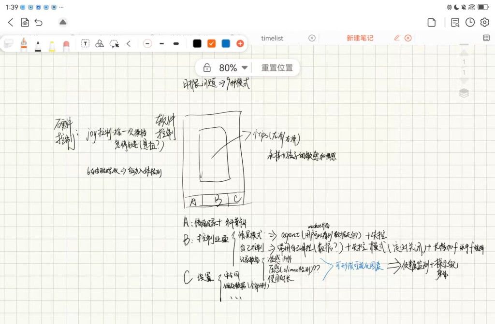
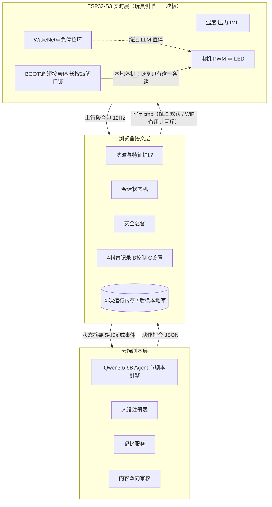
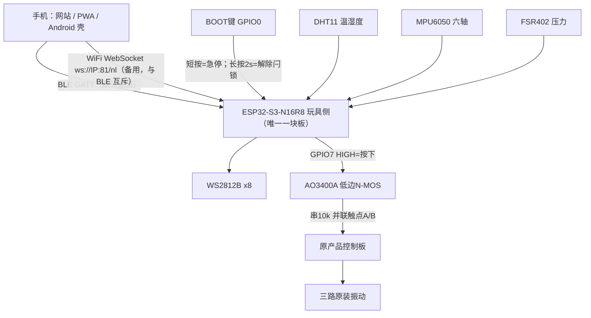
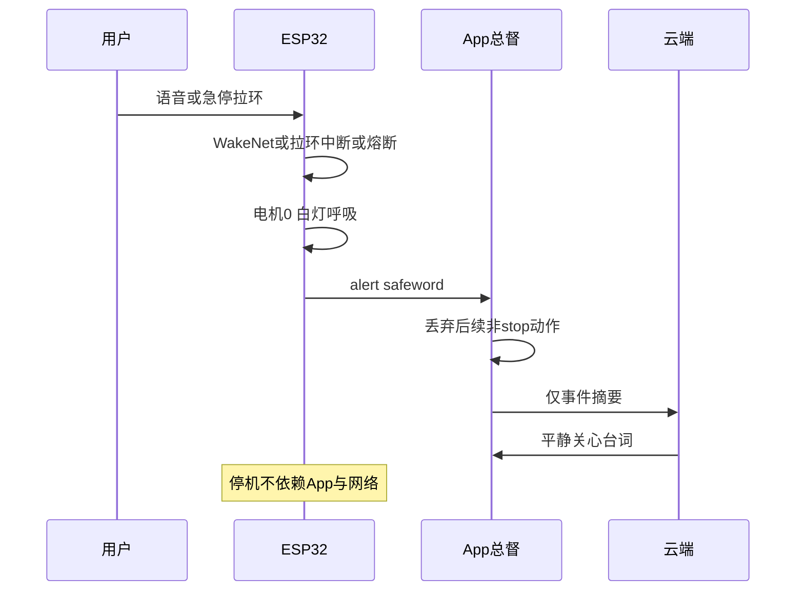

# Nascent Love 软硬件设计技术架构文档

> 仓库内归档。飞书原文 revision 131（2026-08-28），token `FggRdEmySofDoGx2WzFc77MznCd`。
> 协作以本文件为准；飞书只作讨论草稿。改架构必须改本文件并提交，不要只改飞书。
> V1.3（控制端改为网站）、按键语义 / 电机观测器章节、AO3400A 器件选型章节（含 PR #8 的规格书数值修正）均已反向同步回飞书原文。
> 待同步：V1.4 去掉行空板 K10 与 HW504 摇杆、手机直连玩具侧 ESP32-S3，飞书原文仍是双板那一版。B 层模型别名由 `nascent-realtime-9b` 改为 `nascent-chat-9b` / `nascent-control-9b`。验证期心率改为 Gadgetbridge 伴随 APK + Broadcast，飞书原文仍写 Health Connect。

对象：Nascent Love 智能按摩玩具（萨福入体震动棒本体 + ESP32-S3 传感与控制 + 浏览器 Web 控制端 + 云端剧本层）。环境：消费级硬件 MVP → 正式上线。版本：架构综合 V1.4（2026-08-28）。证据窗：三份已定稿飞书材料 + 手绘硬件/信息架构草图 + 已锁定验证期 SKU。冲突处理：情景模式技术设计 V2 与本 RFC 硬件增补（MPU6050 入体推断、玩具侧 DHT11/FSR402/WS2812B）为实现口径；软件信息架构以草图 A/B/C 为准，覆盖 UI V3 的「心绪 / 亲密时刻 / 记录 / 我的」命名。V1.3 把语义层从 Flutter App 改为浏览器网站，GATT 契约与安全总督职责不变。V1.4 去掉行空板 K10 与 HW504 摇杆，手机直连玩具侧 ESP32-S3：GATT 的 UUID 与安全总督职责仍然不变，但停机恢复的物理确认从 K10 的板载双键迁到玩具侧 BOOT 键长按，并且 `resume` 不再是任何传输通道能投递的指令。B 层使用 `Qwen/Qwen3.5-9B` 的 Chat/Control 两个逻辑角色。

来源：Nascent_Love　[Nascent_Love_UI设计与用户旅程 (2)](UI设计与用户旅程.md)（已归档本仓库）　Nascent_Love_情景模式技术设计文档

手绘输入（六轴入体推断、首页=情景+科普 / 控制 / 设置）：



*手绘：PS2摇杆换档、急停、六轴入体推断；App 三层 A 情景+科普 / B 控制 / C 设置*

草图左半边那个「PS2 摇杆换档」已经在 V1.4 撤销，图保持原样只作追溯。它当初进来是因为草图要求「断网也能换档」，而摇杆是当时想到的本地入口；V1.4 判定这条需求原产品的实体按键本来就满足，不值得为它保留一块带屏主控板、一路 ADC 和一段板间转发。急停与六轴入体推断这两块草图输入仍然有效，只是急停的本地入口换成了玩具侧 BOOT 键。

> 主结论：三层运行架构不变（云端剧本、浏览器语义总督、ESP32 本地闭环）。V1.4 固化验证期 SKU：① 手机直连玩具侧 ESP32-S3，BLE GATT 为默认通道、WiFi WebSocket 为备用通道，两者运行时互斥；② MPU6050 接玩具侧开发板做入体推断（不是医疗检测）；③ 玩具侧接 DHT11 温湿度、FSR402 压力、WS2812B×8（手动暖粉红 / 情景雾灰紫 / 失控红流光，换模式才换色、换人不换灯）；④ 软件是网站，首页是「情景记录 + 科普」，其次控制页，再次设置；⑤ 本地物理入口只有玩具侧 BOOT 键：短按急停，长按 2 秒解除停机闩锁，这是全系统唯一能让设备重新动起来的动作。

# 问题、目标与非目标

## 要解决的问题

现有情趣硬件停留在「档位开关 + 手机遥控」。Nascent Love 要把表面温度、接触压力、外部心率与 AI 陪伴接到同一条会话里，同时满足：隐私（本地优先）、合规（拟人化互动新规、非医疗表述）、以及「安全功能永不收费」的品牌红线。没有统一架构时，传感器采样、BLE、LLM 动作指令、安全词会互相穿透，导致延迟不可控、音频上行、或把诊断语义写进产品。

## 目标

- 评审者能按本文件拆分硬件/固件/App/后端并行实现，接口字段与验收口径可证伪。
- 安全不变量在断网、App 崩溃、LLM 解析失败时仍然成立。
- 模块可分期上线：健康报告可先于 AI 陪伴；本地停机与六轴入体推断在 MVP 固件闭环内可用，不依赖 App。

## 非目标

- 不把产品做成医疗器械：禁止核心体温、疾病预警、生理周期/排卵监测表述与算法承诺。
- 不在 MVP 做 Duo 远程双人、自研 Persona 框架、Zepp 官方 API 强依赖。
- 不把 LLM 文本直接转成电机指令；不把原始 12Hz 流与麦克风音频上传云端。

# 约束与不变量

| 类型 | 约束 | 违反后果 |
| --- | --- | --- |
| 安全不变量 | 安全词、温度熔断、急停拉环/玩具侧 BOOT 键短按——全部在 ESP32 本地闭环，绕过 App 与 LLM；停机闩锁只能由 BOOT 键长按解除，没有任何传输通道能投递 `resume` | 断网或模型故障时无法停机；或用户喊停之后设备被远程重新打开 |
| 强度不变量 | 常规档位 PWM 上限 90%；失控模式 15 分钟强制降回 2 档 | 过热、体验失控、合规风险 |
| 数据不变量 | 音频即识别即丢弃；云端只收状态摘要 JSON；本地默认存储，云同步二次授权 | 隐私事故、拟人化服务监管不可过审 |
| 语义不变量 | 对外只称「产品表面/接触温度」「参考性生理反馈」；文案用觉察/记录，不用检测/异常 | 被划入医疗诊断类监管 |
| 商业不变量 | 基础报告、温度四逻辑、安全词、卫生指南、数据导出/删除永久免费 | 「安全收费」舆论与品牌信任崩塌 |

# 关键取舍

| 议题 | 采用 | 否决 | Why |
| --- | --- | --- | --- |
| 实时计算位置 | ESP32 本地闭环 | 云端实时控机 | 安全词延迟需 80–300ms 级；云端路径不可达则产品不可用且不安全 |
| 主控芯片 | ESP32-S3 | 外置语音 DSP + 另一颗 BLE MCU | 双模 SoC + ESP-SR/WakeNet 可离线自定义词，BOM 与固件栈更短 |
| 温度采样 | 12Hz 采样 + 1s 滑动均值；归档 1Hz | 全案方案的 1–2Hz 直出 | 压力节律 1–2Hz，12Hz 满足奈奎斯特；归档降采样控制存储。全案 1–2Hz 视为产品层「趋势输出」而非 ADC 采样率 |
| 心率来源 | 验证期：小米手环 7 + Gadgetbridge 独立 APK + 签名权限 Broadcast；商用仍预留 Health Connect 适配器。上游字段仍是 `hr_trend` / `hr_1hz` / `sensor_context` | 把 Gadgetbridge 源码嵌进主 APK；新增并行 GATT / 二进制特征让心率直控档位 | 验证期需要实时 BPM，Health Connect 对小米手环 7 往往只有同步后的历史点。Gadgetbridge 必须保持独立 APK（AGPLv3）。心率只喂 AI 对话趋势，不得调用 `sendCommand()`，不得下发玩具侧控档。原始 BPM 只留本机 UI | |
| AI 记忆 | 身体档案全局共享 + 关系记忆按 persona_id 隔离 | 每人设独立重校准身体；或全量对话塞进 prompt | 换人设不应让用户重新受伤；全量注入不可扩展且易泄密 |
| 人设生产 | Persona Card JSON + 官方审核制 + 参数化捏人 | 用户自由文本捏人；MVP 即自研 OpenPersona | 自由捏人是监管红线；自研框架周期过长。MVP 用商业 LLM API + 轻量记忆，规模化再评估 Letta/MemU 或自研 |
| 实时 Agent API | `Qwen/Qwen3.5-9B`，逻辑别名 `nascent-chat-9b` 与 `nascent-control-9b`，关闭 Thinking，严格 JSON Schema | App 直连供应商模型；把模型输出当作设备控制命令 | 统一模型适配、方便更换 API 网关；9B 只做语义生成，不拥有 BLE、计时或删除权限 |
| 灯光语义 | 灯随模式与档位，不随人设 | 每人设一套灯效 | 人设管「说什么」，灯光管「在哪种玩法」；降低认知负担，固件可接管安全灯 |
| 离线换档 | 原产品实体按键（与 AO3400A 并联，手按和软件按都有效） | HW504 摇杆（V1.3 方案，已删除）；仅 App 滑块换档 | **这条取舍在 V1.4 被推翻，不是删掉而是换了结论。** 原来的结论是摇杆接 K10、一次有效偏转切一档，理由是草图要求「断网也能换档」，而离散档位正好与 8 档 LED 颗数对齐。去掉摇杆之后，「断网仍能换档」只剩原产品实体按键这一条路——它本来就在，也本来就没被拆掉，为一条已有的退路保留一块带屏主控板、一路 ADC 和一段板间转发不划算。代价必须写清：手机断连时用户只能按原产品实体键循环九档，那一路不受 8 档封顶与固件安全策略约束；玩具侧唯一的本地软件入口是 BOOT 键，它只能停不能开 |
| 手机接入形态 | 手机直连玩具侧 ESP32-S3 | 手机连带屏主控板（行空板 K10），由它转发给玩具侧 | 双板形态里 K10 只做了两件事：摇杆换档和当手机的 BLE 入口。摇杆删掉之后只剩后者，而 BLE 外设玩具侧自己就能做。少一块板、少一条板间链路，停机指令的路径也少一跳 |
| 设备链路 | BLE GATT 为默认 + WiFi WebSocket 为备用，**运行时互斥** | 两条通道并存；或只留 BLE | ESP32-S3 只有一路 2.4GHz 射频，两栈共存要靠时分，12Hz 上行会开始抖，而这条链路上跑着停机指令。备用通道仍要保留，因为部分浏览器根本没有 Web Bluetooth。切换不重置安全状态：闩锁、档位、模式跨传输保持——换一条线连上来不是「新的一次会话」 |
| BLE 协议栈 | 内核自带 Bluedroid（`BLEDevice`） | NimBLE-Arduino | NimBLE 的大版本必须与 arduino-esp32 内核对齐（2.x↔1.4.x、3.x↔2.x），而本仓库没有固定 `espressif32` 版本，平台一升就会静默编译失败。选 NimBLE 原本图的是省 RAM 好让两栈共存，而 BLE 与 WiFi 已改成运行时互斥，这个动机不成立 |
| 停机恢复的确认 | 玩具侧 BOOT 键长按 2 秒，固件里没有 `resume` 分支 | `resume` 指令（V1.3 方案）；K10 板载 A+B 双键 | 双板时期 `resume` 是安全的：指令只可能来自 K10，而 K10 只在用户按下板载双键时才发它。手机直连之后这个前提消失，留着它等于让手机能远程解除用户刚按下的停机。所以恢复路径整体搬出指令通道，`SafetyGovernor::onCommand` 里那个分支直接删除，而不是靠各处记得过滤 |
| 六轴用途 | MPU6050 接玩具侧开发板：入体状态推断 + 静止暂停/拿起唤醒 | V1 只归档、不驱动体验；用压感做「高潮检测」 | 草图要求六轴「自动入体」。压感「高潮检测」在草图中带问号，且踩医疗表述红线，本 RFC 明确不做 |
| App 信息架构 | A 首页情景记录+科普 → B 控制页 → C 设置 | UI V3「心绪 / 亲密时刻 / 我的」为底栏主名 | 草图与本次口头确认覆盖 V3 命名；V3 的去羞耻视觉、安全词置顶、身体笔记能力仍并入 A/B/C |

# 系统架构

三层职责单向收缩：越靠近设备越实时、越不可依赖网络；越靠近云端越只处理已脱敏的语义。图与下文文字等价，图不能单独作为实现依据。



接口方向：设备只认会话 token 与有限 cmd 枚举；App 把 12Hz 流转成特征与 phase，并按 5–10 秒或状态变化生成脱敏传感器摘要；云端只看见摘要，分别调用 Chat / Control 两个逻辑别名。Chat 返回 `dialogue / avatar / scene_ctrl / memory_proposals`，`action` 强制为空；Control 只返回 `hold / recommend / ask`。原始传感器、压力原始值、PCM 和安全词音频止于设备或 App 滚动缓冲。BLE 命令仍使用设备协议里的 `set_level`，那不是 Agent Skill。

| 逻辑别名 | 职责 | 发给供应商的 HTTP `model` |
| --- | --- | --- |
| `nascent-chat-9b` | Chat 9B：台词、情景、记忆候选 | `Qwen/Qwen3.5-9B` |
| `nascent-control-9b` | Control 9B：hold / recommend / ask | `Qwen/Qwen3.5-9B` |

旧别名 `nascent-realtime-9b` 已废弃。`.env.example` 写供应商 ID 是刻意的：HTTP `model` 必须是网关认识的名字，不能把逻辑别名发给供应商。

图里 `BOOT` 的箭头是单向的，这是刻意画法：BOOT 键能把输出降到零，也能解除闩锁让设备重新可控，但它不下达任何加档指令；反过来控制端能加档，却发不出恢复。两端的权限故意不对称。

## 逻辑分层对照

| 层 | 运行位置 | 做什么 | 绝不做什么 |
| --- | --- | --- | --- |
| 实时层 | ESP32-S3 固件（玩具侧唯一一块板） | 采样、滤波、安全词、急停、BOOT 键停机与解闩锁、入体推断、熔断、PWM/LED、静止暂停、两条传输通道的切换与鉴权 | 调 LLM、存音频、执行自由文本、接受任何形式的远程恢复 |
| 语义层 | 浏览器网站，或加载同一网站的 App 壳 | 特征、状态机、A/B/C 三层 UI、本地记录、安全总督；网站用 Web Bluetooth，Android App 用原生 GATT 桥，两者都可退到 WiFi WebSocket | 把 LLM 自由文本直转设备指令；发出 `resume` |
| 剧本层 | 云端后端 | `Qwen/Qwen3.5-9B` Agent 适配、人设 CRUD/审核、记忆 RAG、摘要注入、订阅与年龄验证 | 接触原始流、音频、未过滤的设备控制；直接写入长期记忆或删除数据 |

# 验证期单板 Demo 架构

产品目标态仍是「一支玩具内嵌 ESP32」，验证期现在与它同形：**整个 Demo 只有一块板**，就是与原产品装在一起的玩具侧 ESP32-S3-N16R8，手机直连它。本阶段仍然不绕过原控制板，不独立驱动三路电机。

V1.3 曾把验证期拆成两块板：玩具侧只模拟原按键，带屏主控（行空板 K10）接摇杆、显示本地状态，并作为手机的唯一无线入口。V1.4 删除了整个 `hardware/k10-controller/`。理由在「关键取舍」里已经算过一遍：K10 只承担摇杆换档与 BLE 入口两件事，前者的需求原产品实体按键本来就覆盖，后者玩具侧自己就能做。拓扑因此顺带更接近量产形态，但那是删它的结果，不是删它的理由——理由是这块板换不来它自己的成本。

> 开关器件只模拟按键，不能接电机。电机处测到的 1～2V 多半是 PWM 平均值，与按键模拟无关。2026-08-28 已测完按键触点：关机态两端约 3.7V，超过 3.3V，CD4066 路线（需要供电轨、会倒灌）因此否决，改用 AO3400A 低边 N-MOS，漏极串 10kΩ 把支路电流封在 0.37mA。

## 唯一一块板的职责

| 职责 | 怎么实现 | 边界 |
| --- | --- | --- |
| 无线接入 | 自己做 BLE GATT Peripheral（默认通道），或 WiFi STA + WebSocket 服务端（备用通道） | 同一时刻只开一条。会话令牌由本板签发，不再由别的板转发 |
| 传感与推断 | DHT11、MPU6050、FSR402，12Hz 采样（DHT11 按 ≥1s） | 入体推断、静止暂停、电机振动观测都在本板完成，只把枚举结果上行 |
| 执行 | GPIO7 经 AO3400A 并联原按键，走原板九档逻辑 | 只发按键时序，不接管电机、不测三路振动电流 |
| 本地反馈 | WS2812B×8 灯语（档位 = 点亮颗数）+ USB 串口日志 | 去掉 K10 也就去掉了那块 2.8 寸屏，本地再没有文字界面 |
| 本地物理入口 | 板载 BOOT 键 GPIO0：短按（松手在 600ms 内）= 急停；长按 2 秒 = 解除停机闩锁 | 它只能停、只能解闩锁，**不能加档也不能开机**。600ms～2000ms 是刻意留空的死区 |

原产品路径保持不变：原控制板九档逻辑 → 三路原装振动执行器。实体按钮不拆除，与 AO3400A 并联，手按和软件按都能用。

本地反馈从「2.8 寸屏 + 灯 + 串口」退化成「灯 + 串口」，这是删掉 K10 的真实代价。可接受的原因是灯语承载的本来就是安全语义（档位颗数、安全词白呼吸、清洁琥珀慢闪），这些不需要文字；需要文字的诊断信息本来就在串口和 App 里，而不在那块屏上。

## 两条通信通道

手机直连玩具侧之后只剩一条链路要选，但要选两次：默认走哪条，什么时候退到另一条。

**默认 BLE GATT。** GATT 服务从 K10 整体挪到玩具侧，**UUID 一个都没改**：服务的逻辑身份没变，只是换了个跑它的芯片，换一组新 UUID 只会白白牵动 App 与 Android 壳，换不来任何澄清。只有广播名从 `Nascent-K10` 改成 `Nascent-Toy`，因为那个名字是给人看的。

**备用 WiFi WebSocket。** 玩具侧作 STA 接入现有局域网（不开 SoftAP），起一个 `ws://<玩具 IP>:81/nl`，承载与 BLE **完全相同**的上下行 JSON。留这条通道是因为部分浏览器根本没有 Web Bluetooth，而不是因为 BLE 不够用。STA 凭据优先由设置页经已鉴权的 `set_wifi` 写入玩具 NVS；没有 NVS 时回退到 gitignored 的 `hardware/toy-sidecar/include/local_config.h`。两处都没有时 WiFi 通道不启用，只剩 BLE。密码不上云、不上行、不打串口。

**两条通道运行时互斥，不并存。** ESP32-S3 只有一路 2.4GHz 射频，BLE 与 WiFi 共存要靠时分，12Hz 的上行会开始抖——而这条链路上跑着停机指令，抖动不是体验问题而是安全问题。切换规则：上电起 BLE；当前通道空闲超过 `TRANSPORT_IDLE_SWITCH_MS`（20 秒）**且**另一条已配置，才完整 deinit 再 init 切过去。**切换不重置安全状态**：闩锁、档位、模式全部跨传输保持，换一条线连上来不是「新的一次会话」，更不是解除停机的理由。

BLE 栈用内核自带的 Bluedroid（`BLEDevice`），不用 NimBLE-Arduino。NimBLE 的大版本必须与 arduino-esp32 内核对齐（2.x↔1.4.x、3.x↔2.x），而本仓库没有固定 `espressif32` 版本，平台一升就会静默编译失败；而选 NimBLE 本来图的是省 RAM 好让两栈共存，既然已经改成运行时互斥，这个动机也不成立了。



| 链路 | 采用 | Why / 否决 |
| --- | --- | --- |
| 手机 ↔ 玩具侧（默认） | BLE 5 GATT。玩具侧为 Peripheral，手机为 Central。UUID 沿用，广播名 `Nascent-Toy` | 手机侧本来就是这套代码路径。否决：经中间板转发（多一块板、多一跳，停机路径变长） |
| 手机 ↔ 玩具侧（备用） | WiFi STA + WebSocket，端口与路径进契约（`ws_port` / `ws_path`），mDNS 播 `nascent.local` | 覆盖没有 Web Bluetooth 的浏览器与桌面长时间联调。否决：SoftAP（手机一连就断外网，联调更难）、与 BLE 并存（射频只有一路） |
| 板间链路 | **不存在** | ESP-NOW 随 K10 一起删除。`ack` / `pair` / `heartbeat` 帧也一并删掉：BLE 的写响应与 WebSocket 的 TCP 已经各自负责可靠性 |
| 玩具侧 ↔ 原产品 | AO3400A 低边 N-MOS 并联原按键，漏极串 10kΩ | 不改原板电机驱动。否决：GPIO 直驱电机、这条支路过电机电流、CD4066（触点 3.7V 会倒灌 3V3 轨） |
| 调试备用 | 玩具侧 USB 串口 | 现场联调无线失败时，先用串口短按验证按键支路，再开无线 |

## 手机侧的一条硬限制（不要静默）

网站现在是**纯 HTTP**：FastAPI 用 `app.mount("/", StaticFiles(...))` 托管 `software/app/`，默认 `127.0.0.1:8000`，仓库里没有任何 TLS 配置。由此有两条互斥的路：

- 手机浏览器访问 `http://<PC 局域网 IP>:8000` 不是安全上下文，**Web Bluetooth 用不了**，只能走 WiFi 通道。
- 一旦给网站上 HTTPS，浏览器会按混合内容拦掉 `ws://<玩具 IP>`，**WiFi 通道用不了**，只能走 BLE。

也就是说**手机浏览器上这两条路不可能同时通**。Android 壳没有这个矛盾：`usesCleartextTraffic="true"` 加原生 GATT 桥，两条都能用。因此 **WiFi 备用通道以 Android 壳与桌面 Chrome 作为主要验证路径**，手机浏览器上以 BLE 为准。要在手机浏览器上同时用两条，得先给设备上 TLS，那属于量产范围，本 Demo 不做。

## 设备指令面

GATT 最小服务在玩具侧：Uplink 特征 Notify 12Hz 遥测，Downlink 特征 Write 指令，Info 特征 Read 协议版本与会话令牌。字段以 `protocol/schemas/ble_uplink.json` 与 `ble_downlink.json` 为准，WiFi 通道是同一份载荷，只是没有 Info 特征可读，改由玩具侧在连上后主动先推一帧握手。

```json
{ "cmd": "set_level", "level": 3, "pattern": "wave", "auth": "<session_token>" }
```

可投递的 `cmd` 只有 `stop | set_mode | set_level | set_pattern | set_led`。玩具侧只把它翻译成 GPIO 上的按键时序，不理解「第几档是多强」——档位仍由原板按键状态机决定，本板做的是开环跟踪。

枚举里还有第六个值 `resume`，但**没有任何传输通道能投递它**：固件的 `SafetyGovernor::onCommand` 里已经没有这个分支，`clearLatch()` 全工程只有 BOOT 键的处理函数会调。两条传输各自也会拒绝 `resume` 并置 `alert = "bad_cmd"`，但那只是给 App 的反馈，不是防线——**过滤会漏，不存在的代码路径不会漏**。留着这个枚举值是为了让 App 的安全总督能继续显式拒绝并给出文案。

鉴权与全部下行拒绝规则收在固件的 `downlink_gate.{h,cpp}` 里，**两条传输共用同一份**。这是刻意的：规则抄成两份之后，只改了一边的修补会让另一条链路变成弱点，而攻击者只需要弱的那条。

## 原按键的实测数据

2026-08-28 全部实测完毕，器件选型随之冻结。

| # | 项目 | 结果 |
| --- | --- | --- |
| 1 | 原板电池电压 | 约 3.8V |
| 2 | 触点 A 与 B 压差（未按） | **约 3.7V**；短接则为 0（通路） |
| 3 | 串 1kΩ 短接 | 仍能开机 |
| 4 | 串约 200kΩ 短接 | **仍能开机**（MOSFET 栅极浮空时的 D-S 阻值，意外测得） |

触点电压约等于电池电压，说明按键不是挂在稳压的 3.3V 轨上，而是跟着电池走——
锂电充满 4.2V 时它还会更高。**触点 >3.3V 是整个器件选型的分水岭。**

第 4 行反推出原板上拉阻值：按 CMOS 阈值 0.3×3.8 = 1.14V，
要求 3.7 × 200/(Rpu + 200) ≤ 1.14，得 **Rpu ≥ 约 450kΩ**，即兆欧量级的高阻输入。
（此前只有第 3 行时曾据此估为「至少 3kΩ 量级」，并得出「CD4066 的千欧级导通电阻
可以接受、不需要换 MOS 管」的结论。这个估计本身没错，但它回答的是导通电阻问题，
而真正的否决项在供电侧，见下。）

按键语义也在实测中确定：**长按约 1s = 电源取反**（关机态长按开机并停在第 1 档，
开机态长按关机），**瞬时短接 = 档位循环且仅开机态有效**。这不是「长按=关机」，
差别直接决定固件状态机，见下文。

## 器件选型：AO3400A 低边 N-MOS（已采纳）

选它的理由是**不需要供电轨，也就没有倒灌路径**。触点 3.7V 高于 3.3V，
任何需要 VDD 的开关器件都要在「VDD 取 3.3V 会被倒灌」和「VDD 取 3.8V/5V 就得
引电池线并给控制端加电平转换」之间二选一。N-MOS 的源极直接就是地，
这个问题不存在；栅极天然吃 3.3V 逻辑（Vgs(th) 典型 1.05V、最大 1.45V，3.3V 已完全饱和）。

| AO3400A 引脚（SOT-23） | 接到 |
| --- | --- |
| 1（G 栅极） | GPIO7 串 1kΩ；**另加 47kΩ 下拉到 GND** |
| 3（D 漏极） | 串 **10kΩ** 后接触点 A（3.7V 那端） |
| 2（S 源极） | 触点 B + 原电池负极 + ESP32 GND（三方共地） |

原实体按钮保留并联。

### 那颗 10kΩ 是安全论证的一部分

CD4066 约 10mA 的连续电流上限，过去是「本板不驱动电机」这条不变量的**硬件级**
保证：接上电机会直接烧片子，所以物理上做不到。AO3400A 能过 5.7A，
换器件会让这条物理约束消失，因此在漏极腿串 10kΩ 把它补回来，并且补得更硬：

- 功能侧：导通时节点电压 3.7 × 10/460 ≈ **80mV**，离 1.14V 阈值有 14 倍余量。
- 安全侧：支路电流封顶 3.7V / 10kΩ = **0.37mA**，比 CD4066 的 10mA 还低一个半数量级。
- 不取更大值：47k → 350mV、100k → 670mV，阈值余量迅速被吃掉，而限流收益为零。
- 放漏极侧而非源极侧：即使 MOSFET 的 D-S 击穿短路，支路电流仍被这颗电阻封住。

±5% 碳膜 1/8W 即可（功耗 1.4mW）。因为 10kΩ 完全主导，AO3400A 在 3.3V 栅压下
按 2.5V 规格 Rds(on) < 48mΩ，相对 10kΩ 可忽略——再次强调，选它是因为没有供电轨，不是因为低阻。

**触点两端不加电容。** 原板自带消抖；并电容会拖慢边沿，还会在断开瞬间往原板灌流。
CD4066 那颗 0.1µF 去耦是跟着器件走的，已随器件一并删除。

### 装配与验证顺序

① 先共地（ESP32 GND + 原电池负极）并接好栅极 47kΩ 下拉；② 接 GPIO7 与串的 1kΩ，
确认引脚默认输出低；③ **最后**接 D/S 到触点，此时产品不得自行开机切档；
④ 先不接 GPIO，用杜邦线把栅极点到 3.3V 约 1 秒确认能开机，再接 GPIO7
（避开启动 strapping 脚）。

顺序反了会踩坑：栅极浮空时实测 D-S 约 200kΩ 半导通，一插上触点玩具就开机
（即上表第 4 行那个数据点的来源）。那不是坏管子，是浮空栅极的正常表现。
触点那两根线走焊接飞线，不要走面包板，这条支路对漏电流敏感。

时序按实测取值：短按 120ms、长按 1200ms、短按间隔 350ms、长按间隔 600ms，
与 `hardware/toy-sidecar/include/config.h` 保持一致。

## 附：CD4066 路线（已否决，留档）

原方案是 CD4066BE 模拟开关，曾按「触点是否超过 3.3V」分成情况 A 与情况 B 两套接法。
实测 3.7V 之后两套都不再采用，论证保留以备追溯：

- **情况 A（VDD 取玩具侧 3.3V）**：3.7V 的信号进 VDD=3.3V 的模拟开关，
  会经输入保护二极管往 ESP32 的 3V3 轨倒灌。直接否决。
- **情况 B（VDD 取原板电池 3.8V）**：可行但代价大。要从原板电池引线（不能把 3.8V
  接到 ESP32 的 3.3V 脚，S3 推荐 3.0～3.6V）；控制脚虽可暂时直连——3.3V 占 VDD=3.8V
  的 87%，TI 只在 VDD=5/10/15V 给了 VIH，按 0.7×VDD 推算需 2.66V，余量够——
  但电池放电末期 VDD 掉到 3.3V 以下时 GPIO 高电平会反过来往原板灌流，
  终究要补 BSS138 / 2N7002 让控制电平跟着 VDD 走。
- 当时列过的其它备选：5V 继电器（原板与 ESP32 可不共地）、PhotoMOS。
  1N5819 不能当电平转换，LM741 也不适合。

AO3400A 一次性消掉了整个供电轨与电平转换的问题，所以 `NL_CD4066_CASE_A_3V3` 这个
追溯宏也随之删除，换成 `NL_BTN_SWITCH_AO3400=1`。

## 按键语义与固件状态机

实测语义只有两条，但它推翻了固件原来的假设：

| 动作 | 效果 |
| --- | --- |
| 长按约 1s | 电源**取反**：关机 → 开机并停第 1 档；开机 → 关机 |
| 瞬时短接 | 档位循环，仅开机态有效，关机态短按无反应 |

由此得到三条硬约束，已落到 `hardware/toy-sidecar/src/ao3400.cpp`：

1. **上电不发任何按键。** 原实现在 `begin()` 里盲发一次「对齐用」的长按，
   在新语义下会把关着的玩具打开——用户没要求任何输出、设备却自己动起来，
   是这个产品最坏的失败模式。
2. **降档走「长按关机 → 长按开机 → 短按上去」。** 靠短按绕一圈中途必然经过
   原板第 9 档也就是最强档，用户在降档时被顶一下最大强度是真实的伤害风险，
   多花约 3 秒换掉它。
3. **`requestOffNow()` 在记录为关机时什么都不按。** 那一下长按在关机态是开机。

原板不回传状态，`powered_` / `step_` 都是开环假设。**关机是唯一可信的已知点**：
一次把它关掉的长按之后记录才重新对齐。状态机不预先算「要按几下」，
而是每按完一下都用最新状态重新决策，并带一个按键预算上限，
超了就停手并要求 resync，绝不无限连按原板按键。

## 电机观测器：IMU 作为电源状态的间接反馈

开环记录有个漏洞：有人手按实体键把玩具打开时，固件仍记为关机，
停机指令就会因为「记录为关机」而不发那次长按。玩具上的 MPU6050 能感知电机振动，
这是唯一拿得到的旁证，实现在 `hardware/toy-sidecar/src/motor_sense.cpp`。

**安全不变量：观测结果永不驱动按键。** 它只做两件事——修正开环记录，
以及在停机未确认时报警。修正记录不等于驱动按键：按键仍只由 stop / requestLevel
发出，但记录修正之后 stop 才会真的发出那次长按。停机长按之后若仍观测到振动，
固件保持白灯、置遥测 `flags` bit4、串口喊人，**不自动补按**——长按是取反，
补一下可能反而把它打开。停机依然不能由软件单方面兜底。

反向推断被刻意禁止：「观测不到振动」不能推出「已经关机」，因为第 1 档振动很弱、
玩具悬空时也可能测不到。那种情况只标记档位不可信，不改电源记录。

判据不复用入体推断的 `accel_var_`（人拿起玩具和电机转起来都会把它抬高），
改用一阶差分能量区分高频电机振动与 1-3Hz 体动。阈值必须在实物上标定，
`MOTOR_SENSE_ENABLED` 默认 0，此时观测器恒输出 unknown、只打串口日志，
标定步骤见 `hardware/toy-sidecar/README.md`。

## Demo 阶段明确不做

- 不测、不改三只电机额定电压、电流、PWM 频率、三路驱动关系。
- 不把 DHT11 当作接触面过温熔断；量产 NTC 与 I2S 麦仍待后续焊入。
- 不给设备链路上 TLS，因此手机浏览器上 BLE 与 WiFi 只能二选一（见上一节）。
- 不做任何形式的远程恢复。停机之后能让设备重新动起来的只有 BOOT 键长按。
- 不开 SoftAP：配网走已鉴权的 `set_wifi`（须先连上蓝牙，或已在网上的 WiFi 通道改连），不是手机先连玩具热点。

产品量产仍按前文「玩具内嵌 ESP32 实时层」。本 Demo 证明：手机（BLE 默认 / WiFi 备用）→ 玩具侧单板（DHT11 / MPU6050 / FSR402 / WS2812B×8 + BOOT 键 + AO3400A 模拟按键）→ 原九档逻辑。链路形态到这一步已经和量产一致，剩下的差异只在传感器与外壳。按键触点电压已测（3.7V），开关器件已冻结为 AO3400A 低边 N-MOS + 漏极 10kΩ 限流。

# 硬件与固件设计

## 硬件清单对照（按用户点名项）

下列点名项均已锁定 SKU。验证期 Demo：玩具侧开发板接 DHT11、MPU6050、FSR402、WS2812B×8 与 AO3400A，本地物理入口用板载 BOOT 键。量产另保留双 NTC 接触温感。Datasheet 在仓库 datasheets/ 目录，并附在本节之后。

| 点名项 | 状态 | 文档对应件 | 口径 |
| --- | --- | --- | --- |
| ~~Joy 摇杆~~ | **已删除，留档** | ~~HW504（等同 KY-023 / PS2 双轴）~~ | V1.4 随 K10 一起删除，没有任何固件再读它。它唯一换来的是「手机断连也能换档」，而原产品实体按键本来就给了这条退路。量产若要重新引入手柄摇杆，需重新走一遍取舍 |
| 六轴陀螺仪 | 已锁定 | MPU6050 六轴运动处理传感器 | 接玩具侧开发板。入体状态推断。不是医疗检测 |
| 温感体内 / 体外 | 量产目标 | NTC A 套内接触面 + NTC B 手柄/外壳 | 量产双点接触温感，12 Hz 熔断。Demo 未焊 NTC |
| 温湿度 | 已锁定 | DHT11，装在玩具上 | 只做玩具侧环境温湿度，必须装在玩具上而不是任何外置板上——远处那颗读到的是房间而不是产品。不能替代 NTC 熔断 |
| 压力传感器 | 已锁定 | FSR402 电阻式薄膜压力模块 | 接玩具侧开发板。贴合与节律。不做高潮检测 |
| 环形 LED 换模式换颜色 | 已锁定 | WS2812B×8 | 接玩具侧开发板。手动暖粉红 / 情景雾灰紫 / 失控红流光。换模式才换色，换人不换灯 |
| CD4066BE 模式调控 | 已换件 | AO3400A 低边 N-MOS（单管，替代 CD4066BE 四路模拟开关） | 接玩具侧开发板，并联原按键走原板九档。触点实测 3.7V 高于 3.3V，CD4066 会倒灌 3V3 轨故否决；漏极串 10kΩ 限流 0.37mA |

## 验证期已锁定 SKU（玩具侧单板）

2026-08-28 口头确认：温湿度用 DHT11，且只装在玩具上；六轴用 MPU6050，接玩具侧开发板做入体推断；灯用 WS2812B×8，接玩具侧开发板；压力用 FSR402。换模式才换色（手动暖粉红 / 情景雾灰紫 / 失控红流光），换人不换灯。Datasheet 已下载到仓库 `datasheets/`。同日确认的 HW504 摇杆已随 V1.4 删除，不再接线。

> DHT11 采样间隔 ≥1 s，只做玩具侧环境温湿度。接触面过温熔断仍用产品架构里的双 NTC（12 Hz），Demo 阶段尚未焊 NTC。禁止用 DHT11 读数宣称核心体温或医疗监测。

| SKU | 接哪块板 | 接口（建议） | 用途与约束 |
| --- | --- | --- | --- |
| DHT11 | 玩具侧 ESP32-S3 | GPIO4 单总线，4.7 kΩ 上拉到 3.3 V | 玩具环境温度 + 湿度。最慢约 1 Hz。不参与 12 Hz 安全熔断 |
| MPU6050 | 玩具侧 ESP32-S3 | I2C：GPIO8 SDA / GPIO9 SCL，地址 0x68 | 入体状态推断 inserted / not_inserted / unknown；静止暂停。兼作电机开关状态的间接观测（只读，不驱动按键）。对外禁止「插入检测诊断」 |
| FSR402 | 玩具侧 ESP32-S3 | GPIO1 ADC；FSR 接 3.3 V，10 kΩ 下拉到 GND | 贴合/握持与 1–2 Hz 节律。不做高潮检测 |
| WS2812B×8 | 玩具侧 ESP32-S3 | GPIO6 RMT → DIN；灯珠建议 5 V 供电 | 手动暖粉红 / 情景雾灰紫 / 失控红流光。档位=点亮颗数。3.3 V 数据线进 5 V 灯若不稳定，加电平转换 |
| AO3400A | 玩具侧 ESP32-S3 | 栅极经 1kΩ 接 GPIO7 并 47kΩ 下拉；漏极串 10kΩ 接触点 A；源极接触点 B 并三方共地 | 只模拟短按/长按，走原板九档。10kΩ 把支路电流封在 0.37mA，物理上不能驱动电机。长按是电源取反，上电不盲发按键。替代原 CD4066BE |
| BOOT 键 | 玩具侧 ESP32-S3 | GPIO0，开发板自带，不需要接线 | 短按（≤600ms）急停；长按 2 秒解除停机闩锁。GPIO0 是 strapping 脚，上电按住会进下载模式，那种情况下固件根本不跑，所以不构成安全风险 |

Datasheet 文件：DHT11_Aosong.pdf；MPU-6050_ProductSpec_PS-MPU-6000A.pdf；MPU-6050_RegisterMap_RM-MPU-6000A.pdf；FSR402_Interlink.pdf；FSR402_SparkFun_Layout.pdf；WS2812B_Worldsemi.pdf；HW504_PS2-Joystick_HandsOnTec.pdf 与 KY-023_JoyIT_Manual.pdf（摇杆已随 V1.4 删除，留档备查）；AO3400A_AOS.pdf；CD4066B_TI.pdf（器件已否决，留档备查）。下文以附件形式贴入本文件。

- [DHT11_Aosong.pdf](../../datasheets/DHT11_Aosong.pdf)

- [MPU-6050_ProductSpec_PS-MPU-6000A.pdf](../../datasheets/MPU-6050_ProductSpec_PS-MPU-6000A.pdf)

- [MPU-6050_RegisterMap_RM-MPU-6000A.pdf](../../datasheets/MPU-6050_RegisterMap_RM-MPU-6000A.pdf)

- [FSR402_Interlink.pdf](../../datasheets/FSR402_Interlink.pdf)

- [FSR402_SparkFun_Layout.pdf](../../datasheets/FSR402_SparkFun_Layout.pdf)

- [WS2812B_Worldsemi.pdf](../../datasheets/WS2812B_Worldsemi.pdf)

- [HW504_PS2-Joystick_HandsOnTec.pdf](../../datasheets/HW504_PS2-Joystick_HandsOnTec.pdf)（摇杆已删除，留档）

- [KY-023_JoyIT_Manual.pdf](../../datasheets/KY-023_JoyIT_Manual.pdf)（摇杆已删除，留档）

- [AO3400A_AOS.pdf](../../datasheets/AO3400A_AOS.pdf)

- [CD4066B_TI.pdf](../../datasheets/CD4066B_TI.pdf)（已否决，留档）

## 硬件框图

本体延续萨福医疗级硅胶与第三方检测（黏膜刺激 / 致敏 / 微生物）。电子件嵌在可拆卸传感套与手柄腔。验证期玩具侧一块板上全部装完：DHT11、MPU6050、FSR402、WS2812B×8、AO3400A，本地物理入口用板载 BOOT 键。量产另加双 NTC、急停拉环、I2S 麦；振动仍由原板驱动至 Demo 结束。

| 部件 | 原理 / 接口 | 采样 | 作用与启用 |
| --- | --- | --- | --- |
| 温度 A NTC | 分压 ADC，Steinhart-Hart；硅胶套内层接触面；双组份环氧包封 | 12Hz + 1s 均值 | 量产必用：过冷 / 舒适区间 / 升温趋势 / 清洗可收纳。Demo 未焊 |
| 温度 B NTC | 手柄/外壳环境基准 | 12Hz | 量产必用：与 A 差分。Demo 未焊 |
| DHT11 温湿度 | 单总线数字；装在玩具上，接玩具侧 ESP32 GPIO4；4.7 kΩ 上拉 | ≥1 s/次 | 验证期必用：玩具环境温湿度。不能替代 NTC 熔断，禁止核心体温表述 |
| 压力 FSR402 | 压阻分压（典型 10 kΩ 下拉）；带通提取 1–2Hz 节律；接玩具侧 ADC GPIO1 | 12Hz | 验证期+量产：贴合/握持与节律增强/放缓。不做高潮检测 |
| MPU6050 六轴 | I2C 0x68；3 轴加速度 + 3 轴陀螺 + DMP。接玩具侧 GPIO8/9。姿态/运动推断入体；方差判静止 | 12Hz，固件内状态机 1Hz 决策 | 验证期+MVP：inserted / not_inserted / unknown；放下 30s 暂停。对外用「是否在使用中」 |
| BOOT 键 | 开发板自带的 GPIO0 按键，去抖 `BOOT_KEY_DEBOUNCE_MS`；固件按松手时长分派 | 边沿 + 时长 | 验证期必用：短按（≤600ms）急停，长按 2 秒解除闩锁。**只能停不能开**，加档不走这条路 |
| 急停拉环 | 常闭机械开关，断开即急停；与安全词/App 停止并联 | 硬件中断 | MVP 必用：无网无 App 也能停机。优先级 = 安全词 = 最高。Demo 阶段由 BOOT 键短按代劳，但那是开发板上的键，不是量产要的常闭拉环 |
| I2S 麦 | 16kHz 单声道；AFE（AEC/NS/VAD）+ WakeNet9 / MultiNet | 16kHz | MVP 必用：≤5 个本地关键词，音频不落盘不上云。Demo 可不焊 |
| WS2812B×8 | RMT 单线，玩具侧 GPIO6 → DIN | — | 验证期必用：换模式才换色（手动暖粉红 / 情景雾灰紫 / 失控红流光）；换人不换灯；档位=颗数 |
| 振动电机 | PWM；100% 占空比不开放。Demo 仍由原板驱动 | — | 8 档强度 + 波形；降噪为硬件验收硬指标 |

## 温度四逻辑（固件 + App 提示）

| 逻辑 | 实现 | 用户侧 |
| --- | --- | --- |
| 是否过冷 | temp_a 低于低温阈值，并用 temp_b 做环境差分 | 预热提示；LED 蓝色呼吸 |
| 接近舒适 | 对照个人舒适区间基线（身体档案） | 「快到你习惯的温度了」；暖绿常亮 3 秒 |
| 使用中趋势 | 上升/平稳/下降曲线，不打断使用 | 写入身体笔记 |
| 清洗后可收纳 | 目标区间稳定且无异常波动 | 「已经晾好」；琥珀色慢闪表示未完成 |

## 八档强度与 LED

规则：换模式才换灯，换人不换灯。档位 = 点亮颗数。红色专属失控玩法；安全体系用白/琥珀/绿，不用红。

| 档 | PWM | 波形 | LED | 语义 |
| --- | --- | --- | --- | --- |
| 1 | 15% | 连续极柔 | 1 颗暖粉 | 初识预热 |
| 2 | 25% | 连续柔 | 2 颗暖粉 | 轻抚 |
| 3 | 35% | 浅波浪 | 3 颗粉橙 | 渐入 |
| 4 | 45% | 波浪 | 4 颗粉橙 | 升温 |
| 5 | 55% | 脉冲 | 5 颗橙 | 攀升 |
| 6 | 65% | 强脉冲 | 6 颗橙红 | 深入 |
| 7 | 78% | 混合波 | 7 颗暖红 | 高强度 |
| 8 | 90% | 持续最强 | 8 颗暖红 | 峰值 |

| 模式 / 状态 | LED 语言 | 优先级 |
| --- | --- | --- |
| 我的节奏 | 手动暖粉红静态颗数（档位=颗数） | 模式层 |
| 情境漫游 | 情景雾灰紫流动呼吸，颗数仍表档位 | 模式层 |
| 失控模式 | 失控红流光（8 颗全亮）；二次确认；15 分钟上限 | 模式层 |
| 预热中 | 蓝色呼吸 | 覆盖模式灯 |
| 已达舒适 | 暖绿常亮 3 秒后回模式灯 | 覆盖模式灯 |
| 清洁注意 | 琥珀色慢闪 + App 推送第二通道 | 覆盖模式灯 |
| 安全词 | 立即白光缓慢呼吸，与电机停止同步 | 最高 |
| 低电量 | 橙色快闪 3 次周期提醒 | 设备状态 |

设计红线：LED 是氛围层。关键信息必须有第二通道（震动或 App），因为使用中用户可能背对设备。

## 固件职责

- 12Hz 采集 FSR402 与 MPU6050（DHT11 按 ≥1 s）→ 滑动滤波 → 经当前传输通道上行。
- WakeNet 持续监听（情景模式默认开，可关）；识别后丢弃音频 PCM。
- 温度熔断与 90% 强度封顶，硬件兜底。
- LED 由固件本地渲染：下行只带 state 语义（如 scenario / safeword），不下达逐帧灯效，保证安全灯不被云端覆盖。
- IMU：入体状态推断（姿态+运动模式，输出 inserted / not_inserted / unknown）；方差低于阈值持续 30s → 自动暂停；拿起唤醒。unknown 时不自动开档。
- BOOT 键：短按立即停机并置闩锁；长按 2 秒解除闩锁。这是固件里唯一调用 `clearLatch()` 的地方。
- 急停拉环：GPIO 中断，电机立即 0，白灯呼吸，与安全词共用停机路径。
- 传输通道：默认起 BLE，按空闲时长在 BLE 与 WiFi WebSocket 之间整体切换，同一时刻只开一条；切换不重置安全状态。
- 下行鉴权与拒绝规则收在一处，两条传输共用：缺 token 整包丢弃、非法档位丢弃而不钳位、停机期间只接受 `stop`、`resume` 一律拒绝并记 `bad_cmd`。

## BOOT 键与停机恢复

去掉 K10 之后，板上能就近按到的只剩开发板自带的 BOOT 键（GPIO0），所以急停与恢复这两件事都落到它身上。按松手时的按压时长分派：

| 按压时长 | 动作 |
| --- | --- |
| < `BOOT_KEY_DEBOUNCE_MS`（40ms） | 抖动，忽略 |
| 40ms ～ `BOOT_STOP_MAX_MS`（600ms） | **本地急停**：立即断电、白灯呼吸、置闩锁，`alert = estop` |
| 600ms ～ `BOOT_RESUME_HOLD_MS`（2000ms） | **什么都不做** |
| ≥ 2000ms | **解除闩锁**，设备重新可控（但不自动恢复到停机前的档位） |

中间那段死区是刻意留空的，不是没想好。如果 600ms 之后就开始判恢复，那么一次「想停机但手慢了」的按压就会变成一次恢复——用户的意图是停，结果是开，这是这个产品最坏的失败方向。宁可让偏长的按压什么都不发生，让用户再按一次。

解除闩锁要求长按 2 秒，也是刻意的：它是全系统唯一能让设备重新动起来的动作，必须长到不可能是误触，并且必须要求人在设备旁边。

这条不变量不靠「各处记得过滤 `resume`」来保证，而是靠代码里根本不存在那条路径：`SafetyGovernor::onCommand` 里没有 `NL_CMD_RESUME` 分支，`clearLatch()` 全工程只有 `main.cpp` 的 `pollBootKey()` 一处调用。传输层就算被攻破，也合成不出一次恢复。

# 接口与数据契约

## 设备上行（玩具侧 → 控制端，12Hz 聚合）

两条传输承载的是**同一份**载荷，所以只有一份契约：BLE 走 Notify，WiFi 走 WebSocket 文本帧。

```
`{  "ts": 12345,  "temp_a": 33.2,  "temp_b": 26.1,  "press_l": 412,  "press_r": 398,  "accel": [0.0, 0.0, 1.0],  "gyro": [0.0, 0.0, 0.0],  "insert_state": "unknown",  "mode": "free",  "level": 3,  "battery": 86,  "alert": null}`
```

mode 枚举：free | scenario | wild。insert_state：inserted | not_inserted | unknown（固件推断，非医疗结论）。alert 为 null 或过温 / 低电 / 安全词 / estop / bad_cmd / link_lost。accel/gyro 为瞬时值，入体推断在固件完成，App 只消费枚举。`level` 是玩具侧**实际生效**的档位，与 App 请求值不一致说明被安全总督降了。

原来还有一个 `joy_edge` 字段（none | up | down），随 HW504 摇杆一起在 0.3.0 删除：摇杆是 K10 上的件，K10 没了它也没了。

## 设备下行（控制端 → 玩具侧）

```
`{  "cmd": "set_level",  "level": 3,  "pattern": "wave",  "auth": "session_token"}`
```

可投递的 cmd 仅允许：set_mode | set_level | set_pattern | set_led | stop。set_led 只含 state 语义，不接受逐帧灯效。缺 auth 或 token 过期则整包丢弃且不回错误（不给探测者反馈）。固件对非法 level（< 1 或 > 8）与未知 cmd **丢弃而不钳位**并记 alert——把 99 悄悄改成 8 去执行，比拒绝危险得多。急停与安全词期间只接受 stop。

枚举里的 `resume` 不是可投递指令，理由见「BOOT 键与停机恢复」。原来的 `set_joystick`（`{ "enabled": true, "hold_ramp": false }`）随摇杆一起在 0.3.0 删除，`cmd` 枚举因此中间少了一个值、`resume` 的线序从 6 前移到 5，这是一次破坏性变更，固件与控制端必须同批更新。

## App → 云端状态摘要（5–10s 或事件）

```
`{  "session_id": "...",  "persona_id": "...",  "mode": "scenario",  "phase": "rising",  "temp_state": "reaching_comfort",  "pressure_rhythm": "increasing",  "hr_trend": "steady",  "insert_state": "inserted",  "user_events": ["manual_level_up", "boot_key_estop"],  "current": { "level": 3, "pattern": "wave" }}`
```

phase：warming | rising | plateau | calm。字段均为离散枚举，禁止上传 12Hz 数组。

## 云端 → App 动作契约

Chat 9B 的应用层输出（`AgentTurn`）形如：

```
`{  "dialogue": "台词文本",  "action": null,  "scene_ctrl": "stay",  "emotion": "gentle",  "skill_proposals": [{ "skill_id": "rhythm_segment", "requires_confirmation": true }] }`
```

`action` 必须为 `null`。Agent Skill 白名单只有 `rhythm_segment` 和 `set_pattern`；`hold_current` 只出现在 Control 的 hold 决策里，不能写进模板。档位变化只能来自用户手动控制，或经过确认的 Control 建议，再由 Web UI `Governor` 调用**设备协议** `set_level`（BLE `cmd`，不是 Agent Skill）。过温时拒绝加档、安全词后丢弃一切非 stop 动作。scene_ctrl：advance | stay | end。emotion：gentle | playful | calm。自由文本禁止直转设备指令。

## Session Record（SQLCipher）

```
`{  "session_id": "...",  "ts_start": 0,  "duration_s": 0,  "mode": "scenario",  "persona_id": "...",  "scene_id": "...",  "max_level": 5,  "curves": { "temp_a_1hz": [], "press_1hz": [], "hr_1hz": [] },  "events": [{ "t": 42, "type": "manual_level_up" }],  "user_tags": { "mood": "relaxed", "note": "" },  "ai_summary_draft": ""}`
```

身体笔记生成流：Record → LLM 非评判总结草稿 → 用户确认 → 归档。不确认不入库。失控会话 mode=wild 单独打标，供安全复盘。

身体笔记现为独立底栏「记录」（页内标题「身心记录」）。B3.0 产品口径：长页展示最近一次、近期图谱和非医疗身心参考，底部单一「和 AI 聊聊自己」入口，一次读取当前记录和最多 5 次近期有效记录。旧 `#/intimacy/notes*` 重定向到 `#/records*`。对话只用于自我探索，不返回设备动作；整段对话默认不入库，用户主动保存的发现才写入可删除笔记。

# 软件架构

## 控制端双入口

语义层只有一份 Web UI（`software/app/`）。用户可以从网站进去，也可以从 App 进去，连的都是玩具侧那块 ESP32-S3——不再有中间板。

| 入口 | 怎么打开 | 怎么连玩具侧 |
| --- | --- | --- |
| 网站 | 浏览器打开 FastAPI 托管的页面 | Web Bluetooth（Chrome / Edge，localhost 或 HTTPS）；或退到 WiFi WebSocket |
| PWA App | 网站里「安装为 App」或浏览器添加到主屏幕 | 仍走 Web Bluetooth，因为实际还在 Chrome 里 |
| Android App | `software/app-android/` 的 WebView 打开同一网站 | 原生 GATT 桥。系统 WebView 没有 `navigator.bluetooth`，不能假装有。WiFi 通道同样可用 |

安全总督留在网页里。App 壳只提供传输，不另写一套调档逻辑，也发不出 `resume`——不是因为壳里过滤掉了，而是因为设备端已经没有那条路径。

**这三个入口在手机上并不等价，必须说清。** 网站现在由 FastAPI 以纯 HTTP 托管（默认 `127.0.0.1:8000`，仓库无 TLS 配置），所以手机浏览器访问 `http://<PC 局域网 IP>:8000` 不是安全上下文，Web Bluetooth 直接不可用，只能走 WiFi 通道；而一旦给网站上 HTTPS，`ws://<玩具 IP>` 又会被混合内容拦掉。**手机浏览器上这两条路不可能同时通。** Android 壳没有这个矛盾（`usesCleartextTraffic="true"` + 原生 GATT 桥），因此 WiFi 备用通道以 Android 壳与桌面 Chrome 为主要验证路径，手机浏览器上以 BLE 为准。

## App 信息架构

浏览器底部四 Tab，顺序即用户路径：先记录与科普，再控制设备，再回看身心记录，最后进设置。网站默认深色低光主题；使用中大按钮、单手可达、控制页申请屏幕常亮、一键停止占拇指热区。控制页可返回亲密时刻入口。设备侧没有屏幕，本地只有 WS2812B×8 的灯语和 BOOT 键，所以手机不在时用户能做的只有按 BOOT 键停机或按原产品实体键换档——控制端 UI 是唯一的完整入口，一键停止因此必须常驻可点。

| Tab | 名称 | 内容 |
| --- | --- | --- |
| A 心绪 | 情景记录 + 科普 | 问候；情景/情绪记录入口；「身体小课」科普卡片流；历史情景列表。安全卫生栏目免费。这是启动后的第一屏，不是控制页 |
| B 亲密时刻 | 控制页面 | 设备连接条 + 两个入口：情景模式、自我控制。使用中可看数据走向，但不把图表做成诊断 |
| C 记录 | 身心记录 | 最近一次使用数据、近期图谱、身心参考、和 AI 聊聊自己。文案不写检测高潮、诊断或核心体温 |
| D 我的 | 设置 | 安全词置顶；储存数据与全部删除；设备；AI 伴侣；健康数据接入；通用 |

| B 控制子页 | 对应能力 | 职责 |
| --- | --- | --- |
| 情景模式 | 情境漫游 | 人设列表 + 结构化新建；点选后进入现有漫游使用页。微信式聊天仍未做。失控模式只从「自我控制」进入，不从情景进入 |
| 自己控制 | 我的节奏 | 停止 + 八档 Slider + 失控；不出现人设、情景或聊天入口。App 滑块是唯一的加档入口（原摇杆本地换档已删除）；断连时退回原产品实体按键，那一路不受 8 档封顶约束。滑块松手发送，0 为停止 |

底栏用「心绪 / 亲密时刻 / 记录 / 我的」做主键。Tab 短名「记录」，页内标题「身心记录」。

视觉约束（实现验收）：主色暖珊瑚粉 #F4A7B9 + 雾灰紫 #9B8AA6；过冷 #7EB6D9 / 舒适 #A8D5BA / 注意 #F5C97B；禁用红色做警报。图表给区间带不给小数点级精确值。

## 会话状态机

phase 只由 App 根据特征推进，不由 LLM 指定：预热（过冷或未达舒适或 insert_state=not_inserted）→ 攀升 → 平台 → 平复。insert_state=unknown 不自动开档。任一时刻安全词 / 急停拉环 / stop / 熔断可将状态切到 paused，电机立即 0。

## 安全词多通道

1. 语音：ESP32 WakeNet，情景模式持续监听。
2. 文字：对话输入命中安全词。
3. 急停拉环：机械断开，最高优先级。
4. 手势与实体键：摇一摇手机；玩具侧 BOOT 键短按（Demo 阶段代替量产的常闭拉环）。

触发链：电机停 → 退剧本 → AI 切平静关心 → 柔和暂停页 → 可选事实记录「何时停下」，不做评判。默认词「红灯」，可测。

## AI 陪伴与人设

实时 Agent API 固定使用 `Qwen/Qwen3.5-9B`。服务端逻辑别名为 `nascent-chat-9b` 与 `nascent-control-9b`；发给供应商的 HTTP `model` 字段使用供应商 ID。App 不保存供应商模型名、API Key 或可执行 Prompt。实时调用关闭 Thinking，输出必须通过 JSON Schema、内容审核和 App `Governor`。Chat 只负责台词与表现；Control 只负责待确认节奏建议。验证期健康数据：小米手环 7 的实时 BPM 由 Gadgetbridge 伴随应用广播到 Android 壳，App 只把聚合趋势写入 `sensor_context`（`hr_trend` / `hr_quality` / `hr_source`）。商用路径仍预留 Health Connect 适配器，字段不变。不再使用 Zepp 名称。心率不得驱动档位、停止、恢复或延长失控计时。

三层提示词：① 安全规则层全身份共享、用户不可见；② 人设层注入 Persona Card；③ 会话动态层注入最近 6 轮、滚动摘要、当前 Persona 已授权记忆和脱敏传感器摘要，不全量塞入历史。B3.0 目标类型是 `SensorSnapshot`（压力、产品表面温感、心率聚合特征）；当前联调仍传 `sensor_context` 字典。

发给模型的只有 5–10 秒聚合趋势与质量，不含原始曲线。心率、压力或温感任何单一信号都不能判断 climax、同意或偏好。用户明确表达优先，`unknown` 或质量不足时不得猜测。9B 不得依据传感器自动调档、停止、恢复、延长失控计时或给出诊断结论。验证期 DHT11 是环境温湿，不能当作接触面过温熔断。

每轮请求链路固定为：

```text
user_event
  -> 校验 user_id / persona_id / session_id 与同意状态
  -> 读取当前 Persona 的授权记忆
  -> 注入温度/压力趋势摘要
  -> Qwen/Qwen3.5-9B 流式 JSON
  -> Schema 校验 + 内容审核
  -> dialogue/avatar -> TTS/Waifu
  -> action -> App Governor -> senderProvider
  -> memory_proposals -> 用户确认后写入
```

模型超时、非法 JSON、审核拒绝或记忆服务故障时，回退本地安全短句并使用 `action=null`。停止、急停、温度保护、电量保护、链路看门狗和固件硬超时不依赖 9B、网络、TTS 或 Waifu。

```
`{  "persona_id": "gentle_v1",  "version": "1.2.0",  "identity": { "name": "", "voice_id": "", "avatar": "" },  "personality": { "warmth": 0.9, "initiative": 0.4, "playfulness": 0.6 },  "speech_style": { "pace": "slow", "forbidden_phrases": [] },  "boundaries": { "custom_rules": [] },  "compatible_scenarios": ["scene_01"],  "review_status": "approved"}`
```

review_status 状态机：draft → reviewing → approved。无灯光字段。切换人设 = 换卡片 + 换关系记忆分区；身体档案不重置。过渡仪式可选「是否互相知道」。禁止「你不理我我会难过」类挽留话术。

## 记忆分层

| 层 | 内容 | 范围 | 存储 |
| --- | --- | --- | --- |
| 身体档案 | 舒适温度、强度偏好、节奏基线、安全词历史 | 全局共享 | SQLCipher 结构化字段 |
| 关系记忆 | 共同剧本、小秘密、情感进度 | 按 persona_id 隔离 | sqlite-vec，RAG 注入 |
| 会话记忆 | 当次即时上下文 | 单次 | 内存 + 临时表 |

## 健康数据与报告模块

温度走本机 BLE。心率验证期走 Android 壳接收 Gadgetbridge Broadcast（小米手环 7 实时 BPM）；商用再换 Health Connect 适配器，Session Record 的 `hr_1hz` 与云端 `hr_trend` 不变。原始 BPM 只留本机，发给模型的只有 5–10 秒趋势与质量。iOS 等价路径待决（见未决）。报告结构：时长与节奏、表面温度趋势、心率区间（标明参考性）、历史对比。语言禁止「检测到异常」。IPC 合同见 [`docs/implementation/mi-band7-gadgetbridge-bridge.md`](../implementation/mi-band7-gadgetbridge-bridge.md)。

## 建议工程依赖（实现参考，非契约）

- BLE：Web Bluetooth API；曲线后续可用任意图表库。
- 硬件抽象可参考 buttplug 协议思路自研 GATT，不把 GPL 前端（intiface-central）链进控制端。
- 语音：乐鑫 ESP-SR（WakeNet/MultiNet）。
- 网站由 FastAPI 托管 `software/app/` 静态页，无独立前端构建。

# 安全、失败与兼容



## 四层防线

1. 硬件：WakeNet、急停拉环 / BOOT 键短按、温度熔断——断网有效。没有任何输入能覆盖停机，恢复只能由 BOOT 键长按产生。
2. 固件：90% 封顶、wild 定时关闭（默认 15 分钟）、静止暂停、入体 unknown 不开档。
3. App：安全总督、免打扰、一键停止热区。
4. 云端：输入输出双向过滤、年龄验证、防沉迷、人设审核。

## 失败模式

| 失败 | 表现 | 处理 |
| --- | --- | --- |
| 设备链路断连 | 包超时或连接断开 | **固件归零并按关机时序断电**；App 提示重连，不自动加档。这一条在 V1.4 反转了：双板时期 K10 断连不停机是合理的，因为 K10 上还有摇杆和 2.8 寸屏可以本地控；现在玩具侧唯一的本地入口是 BOOT 键，只能停不能开，手机断连之后没有任何东西能再降档，所以断连不能保持输出 |
| LLM 超时/非 JSON | 动作解析失败 | 兜底话术，action 为空，档位不变 |
| 安全总督拒绝 | 过温仍要求升档 | 丢弃 action，记录事件，UI 不展示「AI 失控加档」 |
| 心率源缺失 | Gadgetbridge 未连、10 秒无样本、或网站/PWA 没有 Android 桥 | `hr_trend` / `hr_quality` 降为 unknown；AI 不以心率为依据；玩具侧档位不变 |
| BOOT 键误触 | 抖动或按压时长落在两个语义之间 | 去抖 `BOOT_KEY_DEBOUNCE_MS`；600ms～2000ms 为死区，什么都不做，让用户再按一次，绝不把一次偏长的停机按压升级成恢复 |
| 手机写 `resume` | App 有 bug 或被接管 | 传输层丢弃并置 `alert = bad_cmd`。真正的防线不是这层过滤，而是固件里没有这条指令分支 |
| 传输通道切换 | BLE 空闲后切到 WiFi，或反向 | 整体 deinit 再 init，切换期间没有下行；**安全状态不重置**，闩锁、档位、模式跨传输保持。切过去起不来就退回原通道 |
| 入体推断误判 | false inserted / 漏检 | unknown 为默认；仅驱动「是否在使用中」UI 与自动暂停，不驱动诊断文案，用户可手动覆盖 |

## 隐私与合规门禁

- 《人工智能拟人化互动服务管理暂行办法》（2026-07-15）：强制年龄验证、时长提醒、禁止情感操纵挽留、禁止向未成年人提供虚拟伴侣。
- 同意是一等公民：每类采集独立授权、可撤回；同意记录（时间戳/范围/版本）入库。
- 云端训练默认关，opt-in 才开。彻底删除入口必须可见。

## 兼容与迁移

- Persona Card 与设备 schema 带 version；固件拒识未知必选字段则保持安全停机策略。
- 协议 `0.3.0-demo` 是**破坏性的 minor**：`cmd` 枚举中间删了 `set_joystick`，线序整体前移，固件与控制端必须同批更新。之所以没有升 major，是因为现场没有已发出的设备，而 major 在本项目里只用于「必须同时支持新旧两代设备」的场合。
- 急停入口为 MVP 必选件。Demo 由玩具侧 BOOT 键短按承担，量产要换成常闭拉环；摇杆已不在必选件里。
- 心率从验证期 Gadgetbridge Broadcast 迁到 Health Connect 时，App 只换采集适配器，Session Record 的 `hr_1hz` 与 `sensor_context.hr_trend` 不变。不得为此新增玩具侧 GATT 特征。

# 上线路径与回滚

| 阶段 | 周期 | 交付与回滚 |
| --- | --- | --- |
| 验证期 | 1–2 月 | Demo：玩具侧 ESP32-S3-N16R8 单板 + AO3400A 并联原按键 + 板载 BOOT 键；手机直连，BLE 默认、WiFi WebSocket 备用且互斥；不接管三路电机。回滚：摘掉 AO3400A 支路，原按键与原九档仍可用。协议回滚要整批回退到 `0.2.0-demo` 并重烧固件，因为 `cmd` 线序变了，混用会静默错位。 |
| 打磨期 | 2–4 月 | 身体笔记可视化与历史对比；Letta/MemU 或等价记忆层；人设审核流。回滚：记忆写入改为仅本地、停 RAG |
| 合规与规模化 | 持续 | 年龄验证/防沉迷/话术黑名单；免费版 + Plus；心率采集换 Health Connect 适配器并做许可证审查。回滚：下线 AI 对话，保留报告与安全功能 |

软件开关：scenario_enabled、llm_action_enabled、hr_enabled、cloud_sync_enabled。关闭任一云能力不得削弱急停、安全词与熔断。

原来还有一个 `joystick_enabled`（关掉后仅 App 控档），随摇杆一起删除。留着它没有意义：现在本来就只有 App 能控档，一个恒真的开关只会让读代码的人以为还有另一条本地路径。停机与恢复**不设开关**——它们不是可配置项。

# 可观测性、测试与验收

## 可观测性

- 设备：alert 计数、安全词/急停次数、BOOT 键短按与长按次数、闩锁解除次数、insert_state 分布、熔断、链路断连、传输通道切换次数与当前通道、电池；不含音频与原始波形。
- App：总督拒绝原因码、LLM schema 失败率、phase 分布、会话时长。
- 云端：审核拦截率、人设版本、摘要 QPS。禁止记录对话原文到共享日志，除非用户工单授权。

## 测试 / 验收

| 项 | 通过标准 |
| --- | --- |
| 安全词与急停 | 断网、杀 App、LLM 挂起三种条件下，说出默认词或短按 BOOT 键，电机在 300ms 内停、白灯呼吸；其间除 `stop` 外的下行指令全部无效 |
| BOOT 键三段语义 | 短按（≤600ms）立即停机并置 `alert = estop`；按住 600ms～2000ms 松手**没有任何变化**；按住 ≥2000ms 解除闩锁且不自动恢复停机前的档位 |
| 恢复不可远程 | 停机后从 App 写 `resume`：设备不恢复，上行出现 `alert = bad_cmd`；抓链路确认恢复动作只可能由 BOOT 键长按产生 |
| 断连即归零 | 停在 5 档时关掉手机蓝牙 / 拔掉 WiFi：设备按关机时序断电，不停留在 5 档，也不在重连后自动回到 5 档 |
| 传输切换不放松安全 | 停机闩锁生效期间让设备从 BLE 切到 WiFi（或反向）再连上：闩锁、档位、模式全部保持，新连接不能解除停机 |
| 通道互斥 | 任一时刻只有一条通道可连：WiFi 在跑时手机扫不到 `Nascent-Toy`，BLE 在跑时 `ws://<玩具 IP>:81/nl` 连不上 |
| 入体推断 | 静置桌面为 not_inserted 或 unknown，不得长时间误报 inserted；用户可手动覆盖；UI 无「诊断/高潮」字样 |
| A/B/C 导航 | 冷启动落在 A 首页（情景记录+科普）；B 为控制；C 为设置且含全部删除；控制页可右滑回 A |
| 温度四逻辑 | 冷机过冷提示；达到个人区间有一次暖绿确认；清洗稳定后收纳提示；文案无「体温/诊断」 |
| 强度封顶 | 设备协议收到 set_level=8 且固件过温时，实际 PWM 不升；常规档示波器测不到 100% 占空比。Agent 不能直接发该命令 |
| 音频隐私 | 抓 BLE 与 HTTPS：无 PCM/音频特征；设备端无音频文件 |
| 摘要契约 | 云端入站无 12Hz 数组；缺字段或未知 cmd 被拒 |
| 免费安全 | 未订阅账号可用基础笔记、四逻辑、安全词、卫生指南、导出与删除 |
| 噪音 | 产品页公布实测分贝；作为硬件放行门禁（阈值与萨福共同标定，本 RFC 不虚标数字） |
| 年龄与挽留 | 未成年不可进入伴侣；话术黑名单抽样 0 命中挽留句 |

# 未决决定

| 项 | 现状 | 阻塞影响 |
| --- | --- | --- |
| 萨福传感套工艺与清洁 SOP | 需对方确认含电子件后的消毒方案与检测报告是否延续 | 阻塞模具与说明书 |
| 9B API 网关与快照 | 模型族已锁定为 `Qwen/Qwen3.5-9B`；具体部署地域、API 网关和可回滚快照需在联调环境登记 | 不阻塞固件；阻塞真实 Agent 延迟、Schema 和内容审核联调 |
| iOS 心率 | Android 验证期走 Gadgetbridge Broadcast；iOS 无等价桥 | 阻塞 iOS 报告完整度，Android 可先发 |
| 入体推断阈值 | 算法与误报率未用真机标定；MVP 必须带 unknown 与手动覆盖 | 不阻塞开模，阻塞「自动入体」作为宣传卖点 |
| 设备链路 TLS | 手机浏览器上 Web Bluetooth 与 `ws://` 不可能同时可用，除非给设备上 TLS；Demo 不做 | 不阻塞 Demo（WiFi 通道以 Android 壳与桌面 Chrome 验证），阻塞「手机浏览器全功能」这个对外口径 |
| 草图「9 种模式 + 时限」 | 三份定稿是 8 档 + wild 时限；9 模式清单未给出 | 不阻塞 MVP 八档；模式表需产品补一页再扩固件枚举 |
| 记忆中台 | 自建轻量存储 + 向量检索接口；是否引入 Letta/MemU 在打磨期评估 | 不改变 `user_id + persona_id` 隔离、用户确认写入和可删除契约 |
| 数据训练与共享条款 | 与萨福未签约 | 阻塞云同步默认策略对外承诺 |

## Demo 硬件未决（先测再焊）

| 项 | 现状 | 阻塞 |
| --- | --- | --- |
| 电机观测阈值 | `MOTOR_JERK_ON_MG2` / `MOTOR_JERK_OFF_MG2` 是占位值，`MOTOR_SENSE_ENABLED=0` | 不阻塞按键与停机主路径；标定完才能靠 IMU 校正电源状态记录 |
| 原板第 9 档之后 | 再短按是回第 1 档还是关机，未测 | 不阻塞：协议封顶 8 档，`requestLevel` 不会主动按到第 9 档 |
| 量产急停件 | Demo 用开发板自带的 BOOT 键，量产要的是常闭机械拉环，选型与安装位置未定 | 不阻塞 Demo 联调（停机路径已经打通），阻塞外壳开模 |
| WiFi 凭据下发 | 设置页经已鉴权的 `set_wifi` 写入 NVS；`local_config.h` 仍可重烧作为回退 | 不阻塞 Demo |

验证期最小集：AO3400A 按上文接（栅极 1kΩ + 47kΩ 下拉，漏极串 10kΩ，三方共地）；玩具侧一块板接 DHT11 / MPU6050 / FSR402 / WS2812B×8，本地入口用板载 BOOT 键；手机直连，BLE 默认、WiFi 备用且互斥；不存在板间链路；原九档与三电机不动。量产 NTC、常闭急停拉环、I2S 麦与安全词仍待后续。
