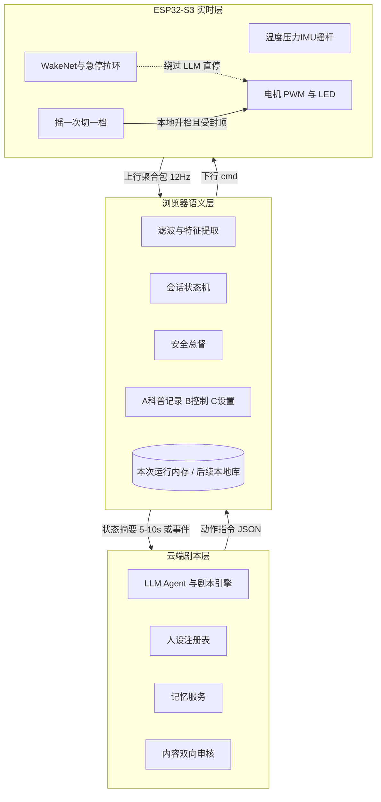
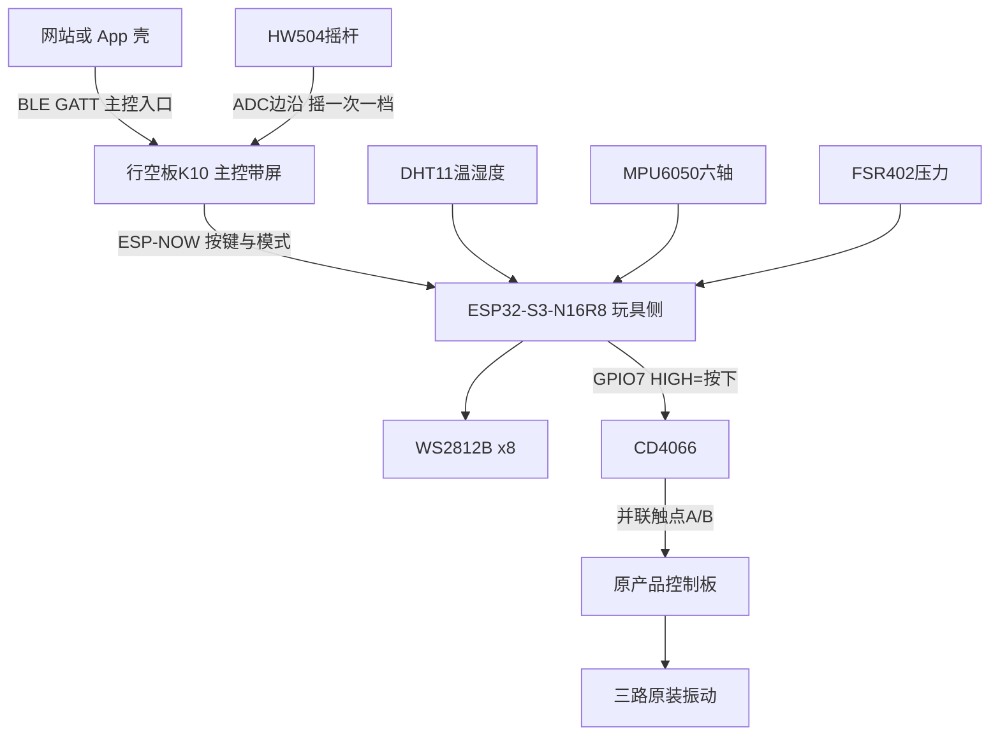
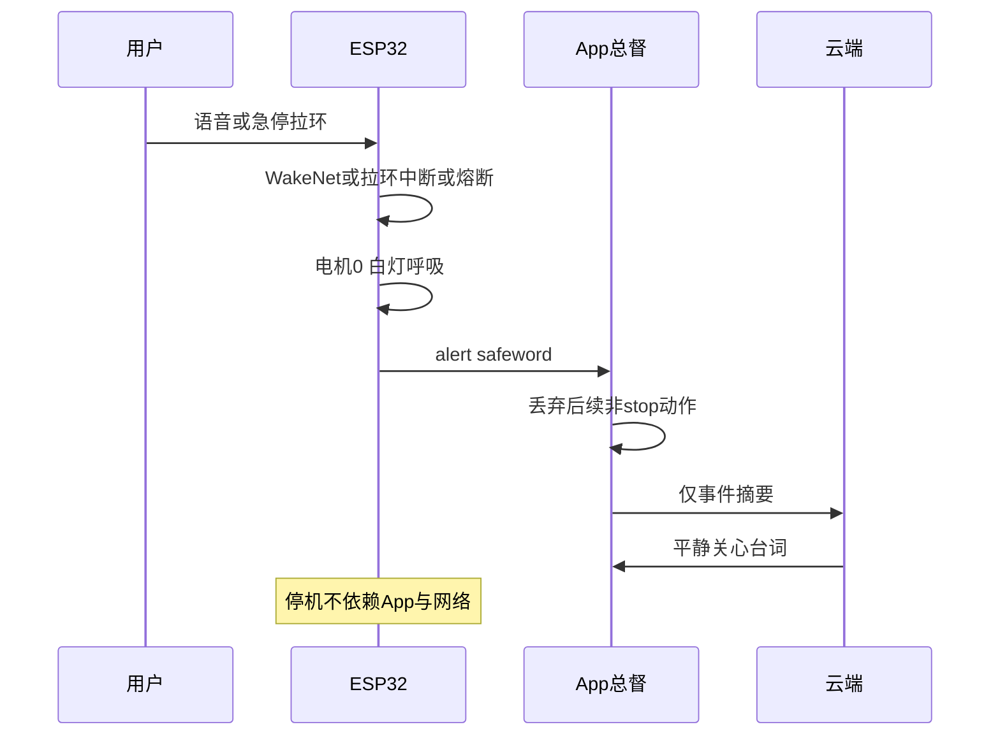

# Nascent Love 软硬件设计技术架构文档

> 仓库内归档。飞书原文 revision 63（2026-08-28），token `FggRdEmySofDoGx2WzFc77MznCd`。
> 协作以本文件为准；飞书只作讨论草稿。改架构必须改本文件并提交，不要只改飞书。

对象：Nascent Love 智能按摩玩具（萨福入体震动棒本体 + ESP32-S3 传感与控制 + 浏览器 Web 控制端 + 云端剧本层）。环境：消费级硬件 MVP → 正式上线。版本：架构综合 V1.3（2026-08-28）。证据窗：三份已定稿飞书材料 + 手绘硬件/信息架构草图 + 已锁定验证期 SKU。冲突处理：情景模式技术设计 V2 与本 RFC 硬件增补（HW504 摇杆、MPU6050 入体推断、玩具侧 DHT11/FSR402/WS2812B）为实现口径；软件信息架构以草图 A/B/C 为准，覆盖 UI V3 的「心绪 / 亲密时刻 / 我的」命名。V1.3 把语义层从 Flutter App 改为浏览器网站，GATT 契约与安全总督职责不变。

来源：Nascent_Love　[Nascent_Love_UI设计与用户旅程 (2)](UI设计与用户旅程.md)（已归档本仓库）　Nascent_Love_情景模式技术设计文档

手绘输入（摇杆换档、六轴入体推断、首页=情景+科普 / 控制 / 设置）：


*手绘：PS2摇杆换档、急停、六轴入体推断；App 三层 A 情景+科普 / B 控制 / C 设置*

> 主结论：三层运行架构不变（云端剧本、浏览器语义总督、ESP32 本地闭环）。V1.3 固化验证期 SKU：① K10 接 HW504 摇杆，摇一次升/切一档，断网仍有效；② MPU6050 接玩具侧开发板做入体推断（不是医疗检测）；③ 玩具侧接 DHT11 温湿度、FSR402 压力、WS2812B×8（手动暖粉红 / 情景雾灰紫 / 失控红流光，换模式才换色、换人不换灯）；④ 软件是网站，首页是「情景记录 + 科普」，其次控制页，再次设置。

# 问题、目标与非目标

## 要解决的问题

现有情趣硬件停留在「档位开关 + 手机遥控」。Nascent Love 要把表面温度、接触压力、外部心率与 AI 陪伴接到同一条会话里，同时满足：隐私（本地优先）、合规（拟人化互动新规、非医疗表述）、以及「安全功能永不收费」的品牌红线。没有统一架构时，传感器采样、BLE、LLM 动作指令、安全词会互相穿透，导致延迟不可控、音频上行、或把诊断语义写进产品。

## 目标

- 评审者能按本文件拆分硬件/固件/App/后端并行实现，接口字段与验收口径可证伪。
- 安全不变量在断网、App 崩溃、LLM 解析失败时仍然成立。
- 模块可分期上线：健康报告可先于 AI 陪伴；摇杆换档与六轴入体推断在 MVP 固件闭环内可用，不依赖 App。

## 非目标

- 不把产品做成医疗器械：禁止核心体温、疾病预警、生理周期/排卵监测表述与算法承诺。
- 不在 MVP 做 Duo 远程双人、自研 Persona 框架、Zepp 官方 API 强依赖。
- 不把 LLM 文本直接转成电机指令；不把原始 12Hz 流与麦克风音频上传云端。

# 约束与不变量

| 类型 | 约束 | 违反后果 |
| --- | --- | --- |
| 安全不变量 | 安全词、温度熔断、急停拉环/实体键、摇杆不改变停机优先级——全部在 ESP32 本地闭环，绕过 App 与 LLM | 断网或模型故障时无法停机 |
| 强度不变量 | 常规档位 PWM 上限 90%；失控模式 15 分钟强制降回 2 档 | 过热、体验失控、合规风险 |
| 数据不变量 | 音频即识别即丢弃；云端只收状态摘要 JSON；本地默认存储，云同步二次授权 | 隐私事故、拟人化服务监管不可过审 |
| 语义不变量 | 对外只称「产品表面/接触温度」「参考性生理反馈」；文案用觉察/记录，不用检测/异常 | 被划入医疗诊断类监管 |
| 商业不变量 | 基础报告、温度四逻辑、安全词、卫生指南、数据导出/删除永久免费 | 「安全收费」舆论与品牌信任崩塌 |

# 关键取舍

| 议题 | 采用 | 否决 | Why |
| --- | --- | --- | --- |
| 实时计算位置 | ESP32 本地闭环 | 云端实时控机 | 安全词延迟需 80–300ms 级；云端路径不可达则产品不可用且不安全 |
| 主控芯片 | ESP32-S3 | 外置语音 DSP + 另一颗 BLE MCU | 双模 SoC + ESP-SR/WakeNet 可离线自定义词，BOM 与固件栈更短 |
| 温度采样 | 12Hz 采样 + 1s 滑动均值；归档 1Hz | 全案方案的 1–2Hz 直出 | 压力节律 1–2Hz，12Hz 满足奈奎斯特；归档降采样控制存储。全案 1–2Hz 视为产品层「趋势输出」而非 ADC 采样率 |
| 心率来源 | MVP：Health Connect；正式：Zepp OAuth | 社区逆向手环协议 | 逆向违 ToS、随时失效；禁止商用 |
| AI 记忆 | 身体档案全局共享 + 关系记忆按 persona_id 隔离 | 每人设独立重校准身体；或全量对话塞进 prompt | 换人设不应让用户重新受伤；全量注入不可扩展且易泄密 |
| 人设生产 | Persona Card JSON + 官方审核制 + 参数化捏人 | 用户自由文本捏人；MVP 即自研 OpenPersona | 自由捏人是监管红线；自研框架周期过长。MVP 用商业 LLM API + 轻量记忆，规模化再评估 Letta/MemU 或自研 |
| 灯光语义 | 灯随模式与档位，不随人设 | 每人设一套灯效 | 人设管「说什么」，灯光管「在哪种玩法」；降低认知负担，固件可接管安全灯 |
| 离线换档 | HW504 摇杆（Demo 接 K10）：有效偏转一次切一档 | 仅 App 滑块换档；或摇杆连续模拟量直驱 PWM | 草图明确「摇一次换一次档」。离散档位与 8 档 LED 颗数对齐，避免模拟量绕过 90% 封顶。App 滑块仍可用，但摇杆在固件本地生效 |
| 六轴用途 | MPU6050 接玩具侧开发板：入体状态推断 + 静止暂停/拿起唤醒 | V1 只归档、不驱动体验；用压感做「高潮检测」 | 草图要求六轴「自动入体」。压感「高潮检测」在草图中带问号，且踩医疗表述红线，本 RFC 明确不做 |
| App 信息架构 | A 首页情景记录+科普 → B 控制页 → C 设置 | UI V3「心绪 / 亲密时刻 / 我的」为底栏主名 | 草图与本次口头确认覆盖 V3 命名；V3 的去羞耻视觉、安全词置顶、身体笔记能力仍并入 A/B/C |

# 系统架构

三层职责单向收缩：越靠近设备越实时、越不可依赖网络；越靠近云端越只处理已脱敏的语义。图与下文文字等价，图不能单独作为实现依据。



接口方向：设备只认会话 token 与有限 cmd 枚举；App 把 12Hz 流转成特征与 phase；云端只看见摘要，返回 dialogue / action / scene_ctrl。原始传感器与音频止于设备或 App 滚动缓冲。

## 逻辑分层对照

| 层 | 运行位置 | 做什么 | 绝不做什么 |
| --- | --- | --- | --- |
| 实时层 | ESP32-S3 固件 | 采样、滤波、安全词、急停、摇杆换档、入体推断、熔断、PWM/LED、静止暂停 | 调 LLM、存音频、执行自由文本 |
| 语义层 | 浏览器网站，或加载同一网站的 App 壳 | 特征、状态机、A/B/C 三层 UI、本地记录、安全总督；网站用 Web Bluetooth，Android App 用原生 GATT 桥 | 把 LLM 自由文本直转设备指令 |
| 剧本层 | 云端后端 | Agent、人设 CRUD/审核、记忆 RAG、订阅与年龄验证 | 接触原始流、音频、未过滤的设备控制 |

# 验证期双板 Demo 架构

产品目标态仍是「一支玩具内嵌 ESP32」。验证期拆成两块板：玩具侧只负责模拟原按键；带屏主控负责摇杆、本地 UI，并作为手机的唯一无线入口。本阶段不绕过原控制板，不独立驱动三路电机。

> CD4066 只模拟按键，连续电流约 10mA 上限，不能接电机。电机处测到的 1～2V 多半是 PWM 平均值，与按键模拟无关。先测原按键两个有效触点对地电压，再决定 CD4066 供电。

## 两块板的分工

| 板 | 型号 | 职责 |
| --- | --- | --- |
| 主控（人机） | 行空板 K10（板载 ESP32-S3 N16R8、2.8 寸 240×320 屏、Wi-Fi + BLE 5） | 接 HW504 摇杆；本地显示档位/连接状态；作为手机的 BLE 外设；把「短按/长按/摇杆换档」转发给玩具侧。不直接焊到原产品按键 |
| 玩具侧（执行 + 传感） | 独立 ESP32-S3-N16R8 模组 | 与原产品放在一起。GPIO 控制 CD4066 并联原按键；同时接入 DHT11、MPU6050、FSR402、WS2812B×8。只发按键时序，不接管电机、不测三路振动电流 |

原产品路径保持：原控制板九档逻辑 → 三路原装振动执行器。实体按钮不拆除，与 CD4066 并联，手按和软件按都能用。

## 通信怎么选

结论：手机只连 K10；两块 ESP32 之间不要再占一条 BLE。K10 若同时做 BLE 外设（对手机）又做 BLE 主机（对玩具侧），双角色协议栈在 Demo 上容易打满、断连难查。两块都是 ESP32-S3，板间用 ESP-NOW。



| 链路 | 采用 | Why / 否决 |
| --- | --- | --- |
| 手机 ↔ K10 | BLE 5 GATT。K10 为 Peripheral，手机为 Central | App 已有 BLE 方向；K10 带屏可在无手机时本地控。否决：两块板都直接连手机（双外设，App 要维护两条连接） |
| K10 ↔ 玩具侧 ESP32 | ESP-NOW（2.4G，绑定 MAC） | 同为 ESP32-S3，延迟低、无配对、不和手机 BLE 抢角色。备选才是 K10 NimBLE 双角色再连玩具侧 GATT |
| 玩具侧 ↔ 原产品 | CD4066 模拟开关并联原按键 | 不改原板电机驱动。否决：GPIO 直驱电机、CD4066 过电机电流 |
| 调试备用 | K10 SoftAP / 串口；玩具侧 USB 串口 | 现场联调 BLE 失败时，先串口短按验证 CD4066，再开无线 |

GATT 最小服务（K10 上，手机只打这一层）：特征值 cmd 写 short_press / long_press / joy_up / joy_down / stop；特征值 state 通知 level、link_toy（ESP-NOW 是否在）、batt。K10 收到后原样打成 ESP-NOW 包发给玩具侧。摇杆在 K10 本地做「一次偏转一切档」，再发 joy_up/down，不把模拟量甩给玩具侧。

```json
{ "v": 1, "cmd": "short_press", "dur_ms": 180, "seq": 12 }
```

cmd 枚举：short_press | long_press | press_ms | release | ping。玩具侧只翻译成 GPIO 时序，不理解「第几档」——档位仍由原板按键状态机决定。

## CD4066 与原按键

先测按键，再接线。四脚轻触键通常同侧两脚内部相连；断电通断档找出两组，每组各取一脚记为 A、B，按下后 A-B 应导通。不要把同组两脚当成 A、B。

通电后黑表笔接原产品电池负极，记录六个数（未测完之前不假定是「A=0、B=3.3、按下拉低」）：

| # | 项目 | 未按 | 按下 |
| --- | --- | --- | --- |
| 1 | 原板电池电压 | 已测约 3.8V | — |
| 2 | A 对原板 GND | 待测 | 待测 |
| 3 | B 对原板 GND | 待测 | 待测 |
| 4 | A 与 B 压差 | 待测 | 待测 |

3.8V 是整机电源，按键逻辑可能是 3.3 / 3.0 / 1.8 / 接近电池电压，或扫描矩阵。触点最高电压 ≤3.3V 走情况 A；B 点到 3.7～3.9V 走情况 B。

## 情况 A：触点不超过 3.3V（优先试）

CD4066BE 第一路：14=VDD→玩具侧 3.3V；7=VSS→玩具侧 GND 且接原电池负极（三方共地）；1→触点 A；2→触点 B；13→GPIO7。13 脚 47k～100k 下拉到 GND；14 与 7 之间 0.1µF。LOW 断开，HIGH 导通=按下。原按钮保留并联。

```
`原按钮A ──── 原实体按钮 ──── 原按钮B   │                         │   └──── CD4066 pin1 — pin2 ─┘GPIO7 ── CD4066 pin13（下拉到 GND）3.3V  ── pin14GND   ── pin7 ── 原电池负极`
```

测试顺序：① 只接电源与下拉，确认 13 脚约 0V、1-2 不导通、已共地；② 再接 A/B，产品不得自行开机切档；③ 先不接 GPIO，用杜邦线把 13 脚点到 3.3V：约 0.2s=短按，约 2s=长按；④ 再接 GPIO7（避开启动strapping脚）。短按从 180～200ms、长按从 2.2s、间隔 ≥350ms 起调。

若 HIGH 时 A-B 电阻仍大、信号脚对地停在约 1.5V 而机械按下是 0.02V，原 MCU 可能认不出。则查供电/共地/触点/换另一路开关；仍不行改继电器、PhotoMOS 或晶体管拉低。

## 情况 B：触点可能高于 3.3V

不要把原板 3.8V 接到 ESP32 的 3.3V 脚（S3 推荐 3.0～3.6V）。也不要用 3.3V 的 CD4066 去切 3.8V 信号。可选：① 5V 继电器，原板与 ESP32 可不共地；② CD4066 由原 3.8V 供电，ESP32 GPIO 经 2N7002 / BSS138 / 2N3904 / S8050 做电平转换后再进控制端。1N5819 不能当电平转换，LM741 也不适合。

## Demo 阶段明确不做

- 不测、不改三只电机额定电压、电流、PWM 频率、三路驱动关系。
- 不把 DHT11 当作接触面过温熔断；量产 NTC 与 I2S 麦仍待后续焊入。
- 手机不直连玩具侧 ESP32。

产品量产仍按前文「玩具内嵌 ESP32 实时层」。本 Demo 证明：HW504/手机 → K10 → ESP-NOW → 玩具侧（DHT11 / MPU6050 / FSR402 / WS2812B×8 + CD4066 模拟按键）→ 原九档逻辑。按键电压六项测完后，才能冻结 CD4066 供电方案。

# 硬件与固件设计

## 硬件清单对照（按用户点名项）

下列点名项均已锁定 SKU。验证期 Demo：K10 接 HW504；玩具侧开发板接 DHT11、MPU6050、FSR402、WS2812B×8 与 CD4066。量产另保留双 NTC 接触温感。Datasheet 在仓库 datasheets/ 目录，并附在本节之后。

| 点名项 | 状态 | 文档对应件 | 口径 |
| --- | --- | --- | --- |
| Joy 摇杆 | 已锁定 | HW504（等同 KY-023 / PS2 双轴） | 接 K10。摇一次换一档，不改模式。量产仍可迁到手柄 |
| 六轴陀螺仪 | 已锁定 | MPU6050 六轴运动处理传感器 | 接玩具侧开发板。入体状态推断。不是医疗检测 |
| 温感体内 / 体外 | 量产目标 | NTC A 套内接触面 + NTC B 手柄/外壳 | 量产双点接触温感，12 Hz 熔断。Demo 未焊 NTC |
| 温湿度 | 已锁定 | DHT11，装在玩具上 | 只做玩具侧环境温湿度。不用 K10 板载 AHT20 充当玩具温湿。不能替代 NTC 熔断 |
| 压力传感器 | 已锁定 | FSR402 电阻式薄膜压力模块 | 接玩具侧开发板。贴合与节律。不做高潮检测 |
| 环形 LED 换模式换颜色 | 已锁定 | WS2812B×8 | 接玩具侧开发板。手动暖粉红 / 情景雾灰紫 / 失控红流光。换模式才换色，换人不换灯 |
| CD4066BE 模式调控 | 已写 | CD4066BE 四路模拟开关 | 接玩具侧开发板。手动暖粉红 / 情景雾灰紫 / 失控红流光。换模式才换色，换人不换灯 |

## 验证期已锁定 SKU（玩具侧开发板 + K10 摇杆）

2026-08-28 口头确认：温湿度用 DHT11，且只装在玩具上；六轴用 MPU6050，接玩具侧开发板做入体推断；灯用 WS2812B×8，接玩具侧开发板；压力用 FSR402；摇杆用 HW504。换模式才换色（手动暖粉红 / 情景雾灰紫 / 失控红流光），换人不换灯。Datasheet 已下载到仓库 `datasheets/`。

> DHT11 采样间隔 ≥1 s，只做玩具侧环境温湿度。接触面过温熔断仍用产品架构里的双 NTC（12 Hz），Demo 阶段尚未焊 NTC。禁止用 DHT11 读数宣称核心体温或医疗监测。

| SKU | 接哪块板 | 接口（建议） | 用途与约束 |
| --- | --- | --- | --- |
| DHT11 | 玩具侧 ESP32-S3 | GPIO4 单总线，4.7 kΩ 上拉到 3.3 V | 玩具环境温度 + 湿度。最慢约 1 Hz。不参与 12 Hz 安全熔断 |
| MPU6050 | 玩具侧 ESP32-S3 | I2C：GPIO8 SDA / GPIO9 SCL，地址 0x68 | 入体状态推断 inserted / not_inserted / unknown；静止暂停。对外禁止「插入检测诊断」 |
| FSR402 | 玩具侧 ESP32-S3 | GPIO1 ADC；FSR 接 3.3 V，10 kΩ 下拉到 GND | 贴合/握持与 1–2 Hz 节律。不做高潮检测 |
| WS2812B×8 | 玩具侧 ESP32-S3 | GPIO6 RMT → DIN；灯珠建议 5 V 供电 | 手动暖粉红 / 情景雾灰紫 / 失控红流光。档位=点亮颗数。3.3 V 数据线进 5 V 灯若不稳定，加电平转换 |
| HW504 | K10 主控 | 3.3 V；VRx / VRy → ADC，SW → GPIO 上拉 | 摇一次换一档，不改模式。等价 KY-023 / PS2 双轴。具体 Gravity 还是金手指仍待锁 |
| CD4066BE | 玩具侧 ESP32-S3 | GPIO7 控制一路，并联原按键 | 只模拟短按/长按，走原板九档。不能驱动电机。供电取决于未测的触点电压 |

Datasheet 文件：DHT11_Aosong.pdf；MPU-6050_ProductSpec_PS-MPU-6000A.pdf；MPU-6050_RegisterMap_RM-MPU-6000A.pdf；FSR402_Interlink.pdf；FSR402_SparkFun_Layout.pdf；WS2812B_Worldsemi.pdf；HW504_PS2-Joystick_HandsOnTec.pdf；KY-023_JoyIT_Manual.pdf；CD4066B_TI.pdf。下文以附件形式贴入本文件。

- [DHT11_Aosong.pdf](../../datasheets/DHT11_Aosong.pdf)

- [MPU-6050_ProductSpec_PS-MPU-6000A.pdf](../../datasheets/MPU-6050_ProductSpec_PS-MPU-6000A.pdf)

- [MPU-6050_RegisterMap_RM-MPU-6000A.pdf](../../datasheets/MPU-6050_RegisterMap_RM-MPU-6000A.pdf)

- [FSR402_Interlink.pdf](../../datasheets/FSR402_Interlink.pdf)

- [FSR402_SparkFun_Layout.pdf](../../datasheets/FSR402_SparkFun_Layout.pdf)

- [WS2812B_Worldsemi.pdf](../../datasheets/WS2812B_Worldsemi.pdf)

- [HW504_PS2-Joystick_HandsOnTec.pdf](../../datasheets/HW504_PS2-Joystick_HandsOnTec.pdf)

- [KY-023_JoyIT_Manual.pdf](../../datasheets/KY-023_JoyIT_Manual.pdf)

- [CD4066B_TI.pdf](../../datasheets/CD4066B_TI.pdf)

## 硬件框图

本体延续萨福医疗级硅胶与第三方检测（黏膜刺激 / 致敏 / 微生物）。电子件嵌在可拆卸传感套与手柄腔。验证期玩具侧：DHT11、MPU6050、FSR402、WS2812B×8、CD4066；K10：HW504。量产另加双 NTC、急停拉环、I2S 麦；振动仍由原板驱动至 Demo 结束。

| 部件 | 原理 / 接口 | 采样 | 作用与启用 |
| --- | --- | --- | --- |
| 温度 A NTC | 分压 ADC，Steinhart-Hart；硅胶套内层接触面；双组份环氧包封 | 12Hz + 1s 均值 | 量产必用：过冷 / 舒适区间 / 升温趋势 / 清洗可收纳。Demo 未焊 |
| 温度 B NTC | 手柄/外壳环境基准 | 12Hz | 量产必用：与 A 差分。Demo 未焊 |
| DHT11 温湿度 | 单总线数字；装在玩具上，接玩具侧 ESP32 GPIO4；4.7 kΩ 上拉 | ≥1 s/次 | 验证期必用：玩具环境温湿度。不能替代 NTC 熔断，禁止核心体温表述 |
| 压力 FSR402 | 压阻分压（典型 10 kΩ 下拉）；带通提取 1–2Hz 节律；接玩具侧 ADC GPIO1 | 12Hz | 验证期+量产：贴合/握持与节律增强/放缓。不做高潮检测 |
| MPU6050 六轴 | I2C 0x68；3 轴加速度 + 3 轴陀螺 + DMP。接玩具侧 GPIO8/9。姿态/运动推断入体；方差判静止 | 12Hz，固件内状态机 1Hz 决策 | 验证期+MVP：inserted / not_inserted / unknown；放下 30s 暂停。对外用「是否在使用中」 |
| HW504 摇杆 | 双 10 kΩ 电位器 + SW；3.3 V 接到 K10 ADC。固件做死区、去抖、一次偏转=一次边沿 | 边沿事件 | 验证期必用：有效前推/上拨一次升 1 档。受 90% 封顶与安全停机抢占。不改模式 |
| 急停拉环 | 常闭机械开关，断开即急停；与安全词/App 停止并联 | 硬件中断 | MVP 必用：无网无 App 也能停机。优先级 = 安全词 = 最高 |
| I2S 麦 | 16kHz 单声道；AFE（AEC/NS/VAD）+ WakeNet9 / MultiNet | 16kHz | MVP 必用：≤5 个本地关键词，音频不落盘不上云。Demo 可不焊 |
| WS2812B×8 | RMT 单线，玩具侧 GPIO6 → DIN | — | 验证期必用：换模式才换色（手动暖粉红 / 情景雾灰紫 / 失控红流光）；换人不换灯；档位=颗数 |
| 振动电机 | PWM；100% 占空比不开放。Demo 仍由原板驱动 | — | 8 档强度 + 波形；降噪为硬件验收硬指标 |

## 温度四逻辑（固件 + App 提示）

| 逻辑 | 实现 | 用户侧 |
| --- | --- | --- |
| 是否过冷 | temp_a 低于低温阈值，并用 temp_b 做环境差分 | 预热提示；LED 蓝色呼吸 |
| 接近舒适 | 对照个人舒适区间基线（身体档案） | 「快到你习惯的温度了」；暖绿常亮 3 秒 |
| 使用中趋势 | 上升/平稳/下降曲线，不打断使用 | 写入身体笔记 |
| 清洗后可收纳 | 目标区间稳定且无异常波动 | 「已经晾好」；琥珀色慢闪表示未完成 |

## 八档强度与 LED

规则：换模式才换灯，换人不换灯。档位 = 点亮颗数。红色专属失控玩法；安全体系用白/琥珀/绿，不用红。

| 档 | PWM | 波形 | LED | 语义 |
| --- | --- | --- | --- | --- |
| 1 | 15% | 连续极柔 | 1 颗暖粉 | 初识预热 |
| 2 | 25% | 连续柔 | 2 颗暖粉 | 轻抚 |
| 3 | 35% | 浅波浪 | 3 颗粉橙 | 渐入 |
| 4 | 45% | 波浪 | 4 颗粉橙 | 升温 |
| 5 | 55% | 脉冲 | 5 颗橙 | 攀升 |
| 6 | 65% | 强脉冲 | 6 颗橙红 | 深入 |
| 7 | 78% | 混合波 | 7 颗暖红 | 高强度 |
| 8 | 90% | 持续最强 | 8 颗暖红 | 峰值 |

| 模式 / 状态 | LED 语言 | 优先级 |
| --- | --- | --- |
| 我的节奏 | 手动暖粉红静态颗数（档位=颗数） | 模式层 |
| 情境漫游 | 情景雾灰紫流动呼吸，颗数仍表档位 | 模式层 |
| 失控模式 | 失控红流光（8 颗全亮）；二次确认；15 分钟上限 | 模式层 |
| 预热中 | 蓝色呼吸 | 覆盖模式灯 |
| 已达舒适 | 暖绿常亮 3 秒后回模式灯 | 覆盖模式灯 |
| 清洁注意 | 琥珀色慢闪 + App 推送第二通道 | 覆盖模式灯 |
| 安全词 | 立即白光缓慢呼吸，与电机停止同步 | 最高 |
| 低电量 | 橙色快闪 3 次周期提醒 | 设备状态 |

设计红线：LED 是氛围层。关键信息必须有第二通道（震动或 App），因为使用中用户可能背对设备。

## 固件职责

- 12Hz 采集 FSR402 与 MPU6050（DHT11 按 ≥1 s）→ 滑动滤波 → BLE 上行。
- WakeNet 持续监听（情景模式默认开，可关）；识别后丢弃音频 PCM。
- 温度熔断与 90% 强度封顶，硬件兜底。
- LED 由固件本地渲染：下行只带 state 语义（如 scenario / safeword），不下达逐帧灯效，保证安全灯不被云端覆盖。
- IMU：入体状态推断（姿态+运动模式，输出 inserted / not_inserted / unknown）；方差低于阈值持续 30s → 自动暂停；拿起唤醒。unknown 时不自动开档。
- HW504 摇杆：死区+去抖后，一次有效偏转边沿切一档；急停/安全词期间摇杆事件丢弃。
- 急停拉环：GPIO 中断，电机立即 0，白灯呼吸，与安全词共用停机路径。

## 摇杆换档状态机

摇杆只改档位，不改模式。默认「我的节奏 / 自己控制」下生效；情景模式是否允许摇杆加档由 App 下发 joystick_enabled，固件默认真（断网可控）。

1. 回中区 |x|<死区 且 |y|<死区 → 允许下一次边沿。
2. 越出死区且保持 >80ms → 发一次 level±1，忽略该次偏转的持续模拟量。
3. 必须回中后才接受下一次。这就是「摇一次换一次档」。
4. 自己控制可选模式 hold_ramp：长按越出死区则每 400ms +1，松手按每 400ms -1 直到 1 档或用户再拨。
5. 与 App 滑块并发时，以最后一次本地事件为准，并回传 level。

# 接口与数据契约

## BLE 上行（ESP32 → App，12Hz 聚合）

```
`{  "ts": 12345,  "temp_a": 33.2,  "temp_b": 26.1,  "press_l": 412,  "press_r": 398,  "accel": [0.0, 0.0, 1.0],  "gyro": [0.0, 0.0, 0.0],  "insert_state": "unknown",  "joy_edge": "none",  "mode": "free",  "level": 3,  "battery": 86,  "alert": null}`
```

mode 枚举：free | scenario | wild。insert_state：inserted | not_inserted | unknown（固件推断，非医疗结论）。joy_edge：none | up | down（该 12Hz 窗内最多一次边沿）。alert 为 null 或过温 / 低电 / 安全词 / estop。accel/gyro 为瞬时值，入体推断在固件完成，App 只消费枚举。

## BLE 下行（App → ESP32）

```
`{  "cmd": "set_level",  "params": { "level": 3, "pattern": "wave" },  "auth": "session_token"}`
```

cmd 枚举仅允许：set_mode | set_level | set_pattern | set_led | set_joystick | stop。set_joystick.params：{ "enabled": true, "hold_ramp": false }。set_led.params 只含 state 语义。缺 auth 或 token 过期则丢弃。固件对非法 level（<0 或 >8）与未知 cmd 静默拒绝并记 alert。急停与安全词期间只接受 stop。

## App → 云端状态摘要（5–10s 或事件）

```
`{  "session_id": "...",  "persona_id": "...",  "mode": "scenario",  "phase": "rising",  "temp_state": "reaching_comfort",  "pressure_rhythm": "increasing",  "hr_trend": "steady",  "insert_state": "inserted",  "user_events": ["joy_up", "manual_level_up"],  "current": { "level": 3, "pattern": "wave" }}`
```

phase：warming | rising | plateau | calm。字段均为离散枚举，禁止上传 12Hz 数组。

## 云端 → App 动作契约

```
`{  "dialogue": "台词文本",  "action": { "set_level": 3, "set_pattern": "wave" },  "scene_ctrl": "stay",  "emotion": "gentle"}`
```

scene_ctrl：advance | stay | end。emotion：gentle | playful | calm。自由文本禁止直转设备指令。App 安全总督在 LLM 之外硬编码：截断 set_level 到当前封顶、过温时拒绝加档、安全词后丢弃一切非 stop 动作。

## Session Record（SQLCipher）

```
`{  "session_id": "...",  "ts_start": 0,  "duration_s": 0,  "mode": "scenario",  "persona_id": "...",  "scene_id": "...",  "max_level": 5,  "curves": { "temp_a_1hz": [], "press_1hz": [], "hr_1hz": [] },  "events": [{ "t": 42, "type": "joy_up" }],  "user_tags": { "mood": "relaxed", "note": "" },  "ai_summary_draft": ""}`
```

身体笔记生成流：Record → LLM 非评判总结草稿 → 用户确认 → 归档。不确认不入库。失控会话 mode=wild 单独打标，供安全复盘。

# 软件架构

## 控制端双入口

语义层只有一份 Web UI（`software/app/`）。用户可以从网站进去，也可以从 App 进去，连的都是行空板 K10。

| 入口 | 怎么打开 | 怎么连行空板 |
| --- | --- | --- |
| 网站 | 浏览器打开 FastAPI 托管的页面 | Web Bluetooth（Chrome / Edge，localhost 或 HTTPS） |
| PWA App | 网站里「安装为 App」或浏览器添加到主屏幕 | 仍走 Web Bluetooth，因为实际还在 Chrome 里 |
| Android App | `software/app-android/` 的 WebView 打开同一网站 | 原生 GATT 桥。系统 WebView 没有 `navigator.bluetooth`，不能假装有 |

安全总督留在网页里。App 壳只提供传输，不另写一套调档逻辑，也发不出 `resume`。

## App 信息架构

浏览器底部三 Tab，顺序即用户路径：先记录与科普，再控制设备，最后进设置。网站默认深色低光主题；使用中大按钮、单手可达、控制页申请屏幕常亮、一键停止占拇指热区。控制页可返回亲密时刻入口。K10 带屏，无手机时仍可本地控。

| Tab | 名称 | 内容 |
| --- | --- | --- |
| A 心绪 | 情景记录 + 科普 | 问候；情景/情绪记录入口；「身体小课」科普卡片流；历史情景列表。安全卫生栏目免费。这是启动后的第一屏，不是控制页 |
| B 亲密时刻 | 控制页面 | 设备连接条 + 三个子页：情景模式、自己控制、记录数据。使用中可看数据走向，但不把图表做成诊断 |
| C 我的 | 设置 | 安全词置顶；储存数据与全部删除；设备；AI 伴侣；健康数据接入；通用 |

| B 控制子页 | 对应能力 | 职责 |
| --- | --- | --- |
| 情景模式 | 情境漫游 | 已审人设 + 剧本 beat；用户可见温度/压力/档位走向；可进入失控（二次确认 + 定时关闭） |
| 自己控制 | 我的节奏 | 摇杆一次一档为硬件主控；App 滑块同步。可选 hold_ramp：长按加、松手降。默认低档起步 |
| 记录数据 | 身体笔记 | 使用时长、内外温感趋势、压感节律、入体状态时间线；可视化图表服务「健康监测口径下的自我探索」。Plus 才有因素关联与月年报 |

底栏用「心绪 / 亲密时刻 / 我的」做主键。

视觉约束（实现验收）：主色暖珊瑚粉 #F4A7B9 + 雾灰紫 #9B8AA6；过冷 #7EB6D9 / 舒适 #A8D5BA / 注意 #F5C97B；禁用红色做警报。图表给区间带不给小数点级精确值。

## 会话状态机

phase 只由 App 根据特征推进，不由 LLM 指定：预热（过冷或未达舒适或 insert_state=not_inserted）→ 攀升 → 平台 → 平复。insert_state=unknown 不自动开档。任一时刻安全词 / 急停拉环 / stop / 熔断可将状态切到 paused，电机立即 0。

## 安全词多通道

1. 语音：ESP32 WakeNet，情景模式持续监听。
2. 文字：对话输入命中安全词。
3. 急停拉环：机械断开，最高优先级。
4. 手势：摇一摇手机；实体键（若与拉环分立则长按）。

触发链：电机停 → 退剧本 → AI 切平静关心 → 柔和暂停页 → 可选事实记录「何时停下」，不做评判。默认词「红灯」，可测。

## AI 陪伴与人设

三层提示词：① 安全规则层全身份共享、用户不可见；② 人设层注入 Persona Card；③ 记忆层 RAG top-k，不全量塞入。

```
`{  "persona_id": "gentle_v1",  "version": "1.2.0",  "identity": { "name": "", "voice_id": "", "avatar": "" },  "personality": { "warmth": 0.9, "initiative": 0.4, "playfulness": 0.6 },  "speech_style": { "pace": "slow", "forbidden_phrases": [] },  "boundaries": { "custom_rules": [] },  "compatible_scenarios": ["scene_01"],  "review_status": "approved"}`
```

review_status 状态机：draft → reviewing → approved。无灯光字段。切换人设 = 换卡片 + 换关系记忆分区；身体档案不重置。过渡仪式可选「是否互相知道」。禁止「你不理我我会难过」类挽留话术。

## 记忆分层

| 层 | 内容 | 范围 | 存储 |
| --- | --- | --- | --- |
| 身体档案 | 舒适温度、强度偏好、节奏基线、安全词历史 | 全局共享 | SQLCipher 结构化字段 |
| 关系记忆 | 共同剧本、小秘密、情感进度 | 按 persona_id 隔离 | sqlite-vec，RAG 注入 |
| 会话记忆 | 当次即时上下文 | 单次 | 内存 + 临时表 |

## 健康数据与报告模块

温度走本机 BLE。心率 MVP 走 Android Health Connect（Zepp 写入）；正式商务申请 Zepp OAuth2 heartrate。iOS 等价路径待决（见未决）。报告结构：时长与节奏、表面温度趋势、心率区间（标明参考性）、历史对比。语言禁止「检测到异常」。

## 建议工程依赖（实现参考，非契约）

- BLE：Web Bluetooth API；曲线后续可用任意图表库。
- 硬件抽象可参考 buttplug 协议思路自研 GATT，不把 GPL 前端（intiface-central）链进控制端。
- 语音：乐鑫 ESP-SR（WakeNet/MultiNet）。
- 网站由 FastAPI 托管 `software/app/` 静态页，无独立前端构建。

# 安全、失败与兼容



## 四层防线

1. 硬件：WakeNet、急停拉环、温度熔断——断网有效。摇杆不能覆盖停机。
2. 固件：90% 封顶、wild 定时关闭（默认 15 分钟）、静止暂停、入体 unknown 不开档。
3. App：安全总督、免打扰、一键停止热区。
4. 云端：输入输出双向过滤、年龄验证、防沉迷、人设审核。

## 失败模式

| 失败 | 表现 | 处理 |
| --- | --- | --- |
| BLE 断连 | 包超时 | 固件保持当前安全策略并可本地 stop；App 提示重连，不自动加档 |
| LLM 超时/非 JSON | 动作解析失败 | 兜底话术，action 为空，档位不变 |
| 安全总督拒绝 | 过温仍要求升档 | 丢弃 action，记录事件，UI 不展示「AI 失控加档」 |
| 心率源缺失 | 未授权或手环离线 | 报告降级为无心率；AI 不以心率为依据 |
| 摇杆连击/抖动 | 短时间多次边沿 | 去抖 80ms + 必须回中；安全停机期间丢弃全部 joy_edge |
| 入体推断误判 | false inserted / 漏检 | unknown 为默认；仅驱动「是否在使用中」UI 与自动暂停，不驱动诊断文案，用户可手动覆盖 |

## 隐私与合规门禁

- 《人工智能拟人化互动服务管理暂行办法》（2026-07-15）：强制年龄验证、时长提醒、禁止情感操纵挽留、禁止向未成年人提供虚拟伴侣。
- 同意是一等公民：每类采集独立授权、可撤回；同意记录（时间戳/范围/版本）入库。
- 云端训练默认关，opt-in 才开。彻底删除入口必须可见。

## 兼容与迁移

- Persona Card 与 BLE schema 带 version；固件拒识未知必选字段则保持安全停机策略。
- 摇杆与急停拉环为 MVP 必选件；去掉摇杆则 App 滑块仍可用，但本 RFC 默认两者都在。
- 心率从 Health Connect 迁到 Zepp OAuth 时，App 只换适配器，Session Record 的 hr_1hz 字段不变。

# 上线路径与回滚

| 阶段 | 周期 | 交付与回滚 |
| --- | --- | --- |
| 验证期 | 1–2 月 | Demo：行空板K10（屏+摇杆+手机BLE入口）+ 玩具侧 ESP32-S3-N16R8 + CD4066 并联原按键；板间 ESP-NOW；不接管三路电机。回滚：拔掉 CD4066，原按键与原九档仍可用。 |
| 打磨期 | 2–4 月 | 身体笔记可视化与历史对比；Letta/MemU 或等价记忆层；人设审核流。回滚：记忆写入改为仅本地、停 RAG |
| 合规与规模化 | 持续 | 年龄验证/防沉迷/话术黑名单；免费版 + Plus；申请 Zepp。回滚：下线 AI 对话，保留报告与安全功能 |

软件开关：scenario_enabled、llm_action_enabled、hr_enabled、cloud_sync_enabled、joystick_enabled。关闭 joystick 后仅 App 控档；关闭任一云能力不得削弱急停、安全词与熔断。

# 可观测性、测试与验收

## 可观测性

- 设备：alert 计数、安全词/急停次数、摇杆边沿、insert_state 分布、熔断、BLE 断连、电池；不含音频与原始波形。
- App：总督拒绝原因码、LLM schema 失败率、phase 分布、会话时长。
- 云端：审核拦截率、人设版本、摘要 QPS。禁止记录对话原文到共享日志，除非用户工单授权。

## 测试 / 验收

| 项 | 通过标准 |
| --- | --- |
| 安全词与急停 | 断网、杀 App、LLM 挂起三种条件下，说出默认词或拉急停，电机在 300ms 内停、白灯呼吸；其间摇杆无效 |
| 摇杆一次一档 | 一次有效偏转只变 1 档；不回中不连跳；8 档封顶；示波器 PWM 不超过该档标称 |
| 入体推断 | 静置桌面为 not_inserted 或 unknown，不得长时间误报 inserted；用户可手动覆盖；UI 无「诊断/高潮」字样 |
| A/B/C 导航 | 冷启动落在 A 首页（情景记录+科普）；B 为控制；C 为设置且含全部删除；控制页可右滑回 A |
| 温度四逻辑 | 冷机过冷提示；达到个人区间有一次暖绿确认；清洗稳定后收纳提示；文案无「体温/诊断」 |
| 强度封顶 | LLM 返回 set_level=8 且固件过温时，实际 PWM 不升；常规档示波器测不到 100% 占空比 |
| 音频隐私 | 抓 BLE 与 HTTPS：无 PCM/音频特征；设备端无音频文件 |
| 摘要契约 | 云端入站无 12Hz 数组；缺字段或未知 cmd 被拒 |
| 免费安全 | 未订阅账号可用基础笔记、四逻辑、安全词、卫生指南、导出与删除 |
| 噪音 | 产品页公布实测分贝；作为硬件放行门禁（阈值与萨福共同标定，本 RFC 不虚标数字） |
| 年龄与挽留 | 未成年不可进入伴侣；话术黑名单抽样 0 命中挽留句 |

# 未决决定

| 项 | 现状 | 阻塞影响 |
| --- | --- | --- |
| 萨福传感套工艺与清洁 SOP | 需对方确认含电子件后的消毒方案与检测报告是否延续 | 阻塞模具与说明书 |
| 商业 LLM 供应商 | MVP 用 API，具体厂商未锁 | 不阻塞固件；阻塞内容审核链路联调 |
| iOS 心率 | 材料只写 Health Connect | 阻塞 iOS 报告完整度，Android 可先发 |
| 入体推断阈值 | 算法与误报率未用真机标定；MVP 必须带 unknown 与手动覆盖 | 不阻塞开模，阻塞「自动入体」作为宣传卖点 |
| 摇杆方向与手感 | 前/上=+1、后/下=-1 为默认；左右轴是否切波形待试产手感 | 不阻塞原理图，阻塞丝印与说明书 |
| 草图「9 种模式 + 时限」 | 三份定稿是 8 档 + wild 时限；9 模式清单未给出 | 不阻塞 MVP 八档；模式表需产品补一页再扩固件枚举 |
| 记忆中台 | 自建轻量 vs Letta/MemU | 打磨期再定，契约先按分层记忆稳定 |
| 数据训练与共享条款 | 与萨福未签约 | 阻塞云同步默认策略对外承诺 |

## Demo 硬件未决（先测再焊）

| 项 | 现状 | 阻塞 |
| --- | --- | --- |
| 原按键 A/B 对地电压 | 整机 3.8V 已测；触点电压未测。未按时/按下时 A、B 对 GND 及 A-B 压差共 6 个数 | 阻塞 CD4066 选 3.3V 共地还是 3.8V+电平转换/继电器 |
| K10 摇杆接口 | 用 Gravity 3pin 还是金手指 ADC 未锁；GPIO 需避开 K10 板载占用 | 不阻塞玩具侧 CD4066 串口先测 |

验证期最小集：测完按键六项电压后接 CD4066；K10 接 HW504 + 手机 BLE；玩具侧接 DHT11 / MPU6050 / FSR402 / WS2812B×8；板间 ESP-NOW；原九档与三电机不动。量产 NTC、急停拉环、I2S 麦与安全词仍待后续。
