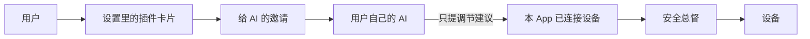
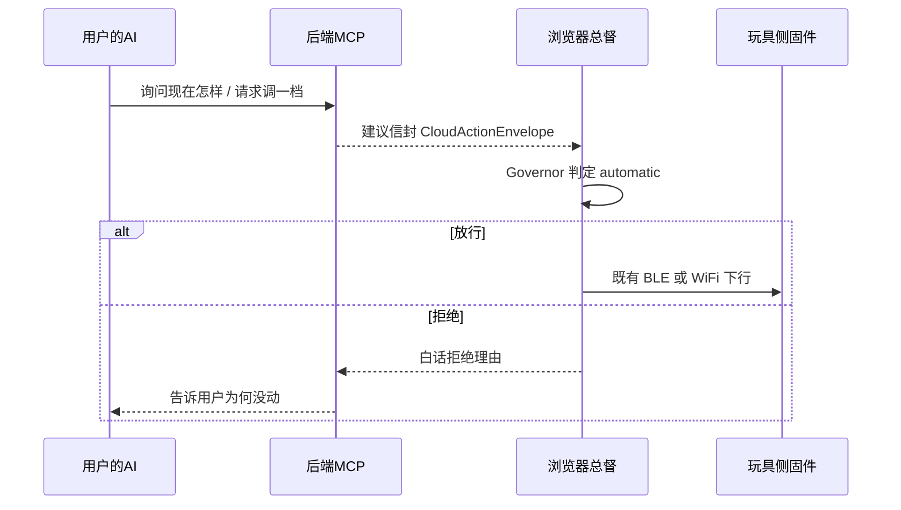

# 连接我的 AI（插件）

> 仓库内权威副本。用户侧产品名是「连接我的 AI」，看起来像一张设置里的插件卡片。
> 底层才是 MCP。改口径必须改本文件并提交，不要只改飞书。
> 设备帧仍以 [`protocol/contract.yaml`](../../protocol/contract.yaml) 为准；本能力不改固件契约。

对象：已经把玩具连上 Nascent App 的用户，希望把调节交给**自己正在用、或正要捏好人设的 AI**。版本：骨架 V0.1（2026-08-29）。

# 上半：产品设计

## 要解决的问题

官方「情境漫游」里的人设是 Nascent 审核过的伴侣。有些人已经在别的地方养好了一个 AI，或想自己慢慢捏，不想换到我们的人设里再来一遍。她们需要的不是再填一张人设表，而是：**设备已经在 App 里连上了，把调节权交给那个 AI，用说话的方式完成轻一点 / 强一点 / 停下。**

很多人听不懂 MCP、令牌、接口。所以产品上它必须是一张插件，三步故事，全是白话。

## 用户故事（三步）

1. 先在本 App 里连上设备（沿用「我的 → 设备」）。
2. 打开插件「连接我的 AI」，确认已成年，得到一份**邀请**。
3. 把邀请贴进自己的 AI（按那个 AI 添加插件 / 连接的方式即可）。之后对 AI 说话，由它来建议调节。

人设不在 Nascent 里重新捏：官方审核人设照旧；这张插件只负责把**设备能力**交给用户自己的 AI。Nascent 管安全和设备，人设归用户自己的 AI。



## 对外文案（用户看得见的）

主界面**不出现** MCP、SSE、token、GATT、Governor 这些词。

| 位置 | 文案 |
| --- | --- |
| 主名 | 连接我的 AI |
| 副文案 | 把已经连上的设备，交给你正在用的 AI 来陪你调节。 |
| 未连接 | 先连接设备，才能把调节交给你的 AI。点卡片只去连接，不谈协议。 |
| 已连接未打开 | 打开后，你常用的 AI 就可以根据你的感觉来调节。停下永远由你或设备说了算。主按钮：打开插件。 |
| 已打开 | 邀请有效。大按钮：复制邀请。说明：打开你的 AI，按它的插件 / 连接方式贴进去。 |
| AI 已连上 | 你的 AI 正在陪你调节。可一键收回邀请，立刻失效。 |
| 复制物名称 | 邀请（不要叫配置文件） |
| 邀请正文 | 设备已连接；AI 只能建议，不能强行恢复；随时可在设置里收回。 |
| 年龄 | 打开前确认「我已满 18 岁」。 |
| 边界 | 这是你自己的 AI，不是官方伴侣。对方说什么我们不审，但设备绝不会做不安全的事。 |
| 恢复 | 只能长按玩具上的 BOOT 键两秒。网站、App 和你的 AI 都不能远程恢复。 |
| 给开发者 | 折叠起来。角标才写 MCP。里面才是地址和 JSON，给 Claude / Cursor 用。 |

邀请正文示例（骨架）：

```text
这是一份「把设备交给我的 AI」的邀请。

把下面这段贴进你正在用的 AI（按它添加插件或连接的方式即可）。

设备已经在 Nascent App 里连上了。
你的 AI 只能建议轻一点、强一点或停下。
停下之后，只有你在设备上长按 BOOT 键两秒才能继续。
随时可以在设置里收回这份邀请。
```

## 信息架构

放在「我的」里，**人设附近**，不要放进「关于」。

- 官方路径：AI 伴侣人设 → 情境漫游里说什么。
- 插件路径：连接我的 AI → 用户自己的 AI 建议怎么调设备。

两条路径都**不能**绕过浏览器安全总督，都不能发 `resume`。

## 非目标

- 不在 Nascent 里做自由文本捏人（监管红线仍在；人设在用户自己的 AI 里）。
- 不把第三方 AI 的对话原文写入共享日志。
- 不做各家 AI 商店的一键安装；骨架只提供邀请 + 折叠 JSON。
- 不改设备 GATT / WiFi 帧，不把原始 12Hz 流或音频交给外部 AI。
- 云端不直接控制硬件。

## 合规包装（给用户看的版本）

打开插件与进入官方 AI 伴侣同一条年龄门槛。开启即视为：用户把调节**建议权**交给第三方 AI，Nascent 仍保留设备否决权。收回邀请等于撤回这次授权。

# 下半：技术

## 在三层里的位置

三层职责不变。本能力只是剧本层多了一条**建议总线入口**：外部 AI 经 MCP 提出建议，形状与 `POST /v1/session/summary` 返回的 `CloudActionEnvelope` 同源；真正发下行的仍是 App 的 `sendCommand()`。



| 层 | 做什么 | 绝不做什么 |
| --- | --- | --- |
| 实时层（固件） | 照旧过滤非法 cmd、90% 封顶、停机闩锁 | 不认识 MCP |
| 语义层（App） | 邀请开关、心跳摘要、拉取待处理建议、只走 `sendCommand()` | 不把 MCP 工具结果直接写成 BLE 包 |
| 剧本层（后端） | 邀请、MCP 骨架、把工具变成建议信封、越界丢弃整段 action | 不碰 BLE / WiFi，不提供 resume 工具 |

## 硬约束

与 [`software/app/js/governor.js`](../../software/app/js/governor.js)、[`software/backend/app/main.py`](../../software/backend/app/main.py) 对齐：

1. MCP **没有** `resume`。停机不能由 AI、App 或云端解除。
2. 调档工具一律按 `automatic: true` 交给总督（`insert_state=unknown` 时挡住自动加档）。
3. `stop` 永远可发。
4. 给 AI 的是心跳摘要（档位、使用状态、是否已停），不是 12Hz 原始流，没有音频。
5. 只有 App 能发下行。云端只排队建议。
6. 档位越界：**整段 action 丢弃，不钳位**。已经最轻还说「轻一点」，告诉 AI 没动，而不是改成 1 档偷偷执行。

## MCP 工具（给模型看的描述用白话）

传输：FastAPI `POST /mcp`，JSON-RPC 2.0（Streamable HTTP 的最小子集）。鉴权：邀请密钥，`Authorization: Bearer`。设置里收回即作废。

| 工具名 | 模型看到的说明 | 内部 |
| --- | --- | --- |
| `how_is_it_going` | 现在舒不舒服、大概第几档。不会改设备。 | 读 App 心跳摘要 |
| `ease_up` | 请轻一点（降一档）。 | `set_level` 当前档 −1，`automatic` |
| `a_bit_stronger` | 请强一点（升一档）。 | `set_level` 当前档 +1，`automatic` |
| `please_stop` | 马上停。 | `stop` |

不暴露：`resume`、`set_led` 逐帧、`set_wifi`、`press_key`、原始遥测。

## App ↔ 云端（骨架）

不改 `protocol/contract.yaml`。

| 接口 | 谁调用 | 作用 |
| --- | --- | --- |
| `POST /v1/plugin/invite` | App | 成年确认后开一份邀请，密钥只在创建时回给 App |
| `GET /v1/plugin/invite/{id}` | App | 邀请是否仍有效、AI 是否已连上 |
| `DELETE /v1/plugin/invite/{id}` | App | 收回，MCP 立刻 401 |
| `PUT /v1/plugin/heartbeat` | App | 上报摘要：是否连接、档位、insert_state、alert |
| `GET /v1/plugin/pending` | App | 拉取一条待处理建议 |
| `POST /v1/plugin/result` | App | 总督放行或拒绝的白话结果，供工具调用返回 |

邀请与建议存在进程内存里，重启即丢。这与当前人设 / 模板骨架一致，不是生产持久化。

## 失败模式

| 失败 | 用户 / AI 看到 | 设备 |
| --- | --- | --- |
| 设备没连 | 卡片引导去连接；工具说还不知道现在怎样 | 不变 |
| 邀请已收回 | 插件回到未打开；MCP 连不上 | 不变 |
| 总督拒绝自动加档 | AI 得到「现在还不能自动调节」 | 档位不变 |
| 越界档位 | AI 得到「这个建议不可用」 | 档位不变（未钳位） |
| App 被杀掉 | 建议停在队列里执行不了；心跳过期后工具据实说 App 不在 | 固件按断连策略停机 |
| 外部 AI 胡言 | 没有对应工具则调不了设备 | 不变 |

## 实现边界（本轮骨架）

- 设置页插件卡片、年龄确认、复制邀请、收回、给开发者折叠。
- 后端邀请 API + MCP `initialize` / `tools/list` / `tools/call`。
- App 短轮询待处理建议，调档走总督。
- 不接各家 AI 的一键商店，不改固件，不改 `contract.yaml`。
