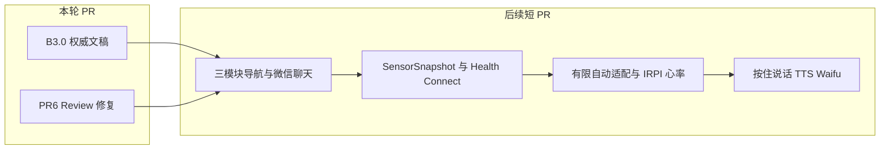

# B3.0 审查与 PR #6 收口

> 日期：2026-08-28
> 范围：把 B3.0 写成仓库权威规格，并收口 Draft PR #6 的 Review 清单；不自动合并。
> 本轮不改情景导航、Health Connect 或自动调档执行。

## 审查结论

B3.0 和现有安全不变量一致，可以作为下一阶段产品口径：双 9B 只给建议、停机绕过模型、失控模式不计时延长、传感器不能单独判断 climax / 同意 / 健康、偏好必须用户确认。

它和**当前代码 / B2.0 文稿**的主要分歧如下（规格先写入文稿，完整 UI 与传感器接入拆后续 PR）：

- **我的节奏**：B3.0 只要 `自由档位` + `失控模式`。现在控制页把 Slider 和「手动 / 情景 / 失控」放在同一层；情景模式文档曾给人设入口。
- **身体笔记**：B3.0 详情底部只有一个 `了解自己`（一次读当前 + 最多 5 次近期）。PR #6 过渡实现仍是两个同级按钮 `只看这一次` / `参考近期记录`。
- **传感**：B3.0 要 `SensorSnapshot` + 心率（Health Connect / 小米手环）+ `ResponseAssessment` / `WellnessAssessment`。代码仍是松散 `sensor_context`，IRPI 仍是五因子 `0.45 / 0.25 / 0.15 / 0.10 / 0.05`（无心率）。验证期硬件只有 DHT11 环境温湿，不能写成接触面过温熔断。
- **模型名**：逻辑别名是 `nascent-chat-9b` 与 `nascent-control-9b`，供应商 ID 是 `Qwen/Qwen3.5-9B`。旧别名 `nascent-realtime-9b` 已废弃。HTTP `model` 字段必须用供应商认识的名字。
- **Skill**：Agent Skill 白名单是 `rhythm_segment` / `set_pattern`。BLE 协议里的 `set_level` 是设备命令，不是 Agent Skill，不要改协议来迁就 Agent。
- **协议生成 Dart / C**：应用层类型放 `agent_contract.py` / `body_note_contract.py`，不要塞进 `protocol/contract.yaml`。协议里已有 `CloudSummary.hr_trend` 和 `SessionRecord.hr_1hz`，那是会话摘要字段，不能代替 `SensorSnapshot`。
- **手环品牌**：B3.0 口径统一为小米手环 + Android Health Connect；验证期 Web 无此通道。
- **SkillProposal 载荷**：当前提案对象主要带 `skill_id`；档位 / Pattern / 时长在 `HardwareSkill` / `ControlDecision` 上。补齐提案字段放到后续自动适配 PR。

Draft PR 现状：[PR #6](https://github.com/Binomial-distribution/nascent/pull/6) 保持 Draft；完整情景 UI、传感器接入、有限自动适配和语音拆后续短 PR。

## 本轮文档收口

升级 [`docs/architecture/B层完整版技术文稿-双模型与偏好闭环.md`](../architecture/B层完整版技术文稿-双模型与偏好闭环.md) 为 B3.0，并同步：

- [`产品架构.md`](../architecture/产品架构.md)
- [`B层情景模式技术实现.md`](../architecture/B层情景模式技术实现.md)
- [`B层Agent提示词契约.md`](../architecture/B层Agent提示词契约.md)
- [`B层实时Agent与语音方案.md`](../architecture/B层实时Agent与语音方案.md)
- [`app-heart-intimacy-plan.md`](app-heart-intimacy-plan.md)

删除 API 以代码为准：

- 现网：`DELETE /v1/agent/memory/{id}`、`DELETE /v1/agent/memory`、`DELETE /v1/agent/templates/{id}`、`DELETE /v1/agent/preferences?user_id&persona_id&template_id`、`DELETE /v1/body-notes/sessions/{id}`、`DELETE /v1/body-notes/{note_id}`
- 文稿不再写不存在的 `DELETE /v1/preference/{preference_id}` 和 `DELETE /v1/session/{session_id}`

## PR #6 Review 清单

| 问题 | 改法 |
| --- | --- |
| `generate_control` 把合法 `hold` + `skill_id=null` 改写成 `skill_not_allowed` | `decision==hold` 时清空建议字段并保留原 `reason_codes`；非 hold 才做 allowlist 检查 |
| 身体笔记加载竞态 | 后端可用性未定时删除失败关闭；启动等待 `load()`，加载中禁用删除 |
| 「固定偏好」误杀 | 去掉会匹配「不代表固定偏好」的裸词；测试允许否定句、拒绝「说明你喜欢」类断言 |
| `search_memory` 负 limit | 将 limit 限制到 `1..20` |
| 未知 mode 崩聊天页 | 未知模式回退到 `free` 的 UI 文案 |
| SW 旧缓存 | bump cache 版本，activate 时删除非当前 cache |
| 无 CI | 最小 workflow：`pytest` + `ruff` + 前端测试 + `gen.py --check` |

## 明确不做

情景漫游三入口与微信聊天页、我的节奏两入口分层、身体笔记改单按钮、Health Connect、SQLCipher、IRPI 心率权重改代码、有限自动适配执行、按住说话 / TTS / Waifu。不自动合并 PR #6。
