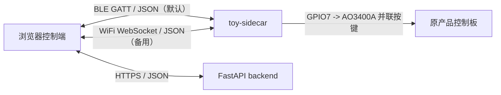

# protocol —— 三端唯一事实来源

固件、App、后端的所有字段、枚举、阈值都从 [`contract.yaml`](contract.yaml) 生成。
这一层的存在意义只有一个：**三端不许各写各的**。

## 改协议的唯一流程

```bash
# 1. 改 contract.yaml
# 2. 重新生成
python3 tools/gen.py
# 3. 提交 contract.yaml + generated/ + schemas/ 的全部变更
```

CI / 提交前自检：

```bash
python3 tools/gen.py --check   # 产物与契约不一致则退出码 1
```

`generated/` 与 `schemas/` **进版本库**，这样固件在没有 Python 的机器上也能直接编译。
它们**禁止手改**，下一次生成会覆盖。

`tools/gen.py` 不依赖第三方库；装了 PyYAML 就用 PyYAML，没装则用内置的受限 YAML 子集解析器。
读写一律显式 UTF-8、换行一律 LF，所以 Windows 中文环境下也能直接跑。

## 三条链路



| 链路 | 编码 | 契约文件 |
|---|---|---|
| App ↔ 玩具侧（默认） | JSON over BLE GATT | [`ble_gatt.md`](ble_gatt.md)、`schemas/ble_uplink.json`、`schemas/ble_downlink.json` |
| App ↔ 玩具侧（备用） | 同一份 JSON over WebSocket | [`wifi_ws.md`](wifi_ws.md)、同上两个 schema |
| App ↔ 后端 | JSON over HTTPS | `schemas/cloud_summary.json`、`schemas/cloud_action.json` |
| App 本地归档 | SQLCipher | `schemas/session_record.json` |

两条设备链路承载**完全相同**的载荷，所以只有两个 schema，不是四个。
BLE 优先；同一时刻只开一条，理由见 [`wifi_ws.md`](wifi_ws.md) 的「BLE 与 WiFi 互斥」。

`generated/nascent_protocol.h` 里的 `nl_telemetry_t` / `nl_command_t` 不再是线上格式，
0.3.0 起它们是玩具侧固件的内部表示。

## 产物去向

| 生成物 | 消费方 | 接法 |
|---|---|---|
| `generated/nascent_protocol.h` | toy-sidecar 固件 | `build_flags = -I../../protocol/generated` |
| `generated/protocol.dart` | 对照用 | 仍生成，控制端不再消费 |
| `generated/protocol.js` | 浏览器控制端 | 构建前拷贝到 `software/app/js/protocol.js` |
| `generated/protocol.py` | FastAPI 后端 | 构建前拷贝到 `software/backend/app/protocol.py` |
| `schemas/*.json` | 联调与契约测试 | 任意 JSON Schema 校验器 |

## 版本策略

当前 `0.3.0-demo`。

- **major** 变更 = 线上不兼容。App 只校验主版本，主版本不同直接拒连。
- **minor** 变更 = 向后兼容的字段追加。
- `-demo` 后缀表示这是验证期形态（原产品按键仍由 AO3400A 模拟），不是量产形态。

`0.3.0` 是一次**破坏性的 minor**：`cmd` 枚举中间删了一个值，线序整体前移。
之所以没有升 major，是因为现场没有已发出的设备，而 major 在本项目里只用于
"必须同时支持新旧两代设备"的场合。固件与控制端同批更新即可，详见 `CHANGELOG.md`。

### demo 与量产的差异（重要）

BLE 上行契约的字段名按**量产形态**取：单板 ESP32 直连手机、双 NTC 接触测温。
0.3.0 起链路形态已经和量产一致（手机直连玩具侧），剩下的差异只在传感器：

- `temp_a` / `temp_b` 保留字段名，声明为 nullable，**demo 阶段恒为 `null`**（结构体里是 `SENTINEL_I16`）。
- 新增 `env_temp` / `env_humidity` 承载 DHT11。
- **DHT11 不是安全通道。** 它最快 1 Hz（`DHT11_MIN_INTERVAL_MS`），不能用于接触面过温熔断。
  熔断在量产要靠 12 Hz 的接触 NTC，demo 阶段尚未焊。任何用 `env_temp` 做熔断的代码都是 bug。

## 三条固化的安全约定

1. **枚举 0 号一律是最安全的取值。** 一帧全零的坏包解出来是 `stop` / `unknown` / `none`，不是加档。
2. **档位只能经 `nl_clamp_level()` 落地。** 云端自由文本永远不能直转设备指令，
   App 侧的安全总督与固件侧的封顶是两道独立的关，任何一道都不得省略。
3. **`resume` 不可投递。** 它在 `cmd` 枚举里，但没有任何传输层能把它送到安全总督面前；
   解除停机闩锁只有玩具侧 BOOT 键长按一条路。这条不变量靠"固件不实现这个分支"来保证，
   不靠各传输层各自过滤——过滤是会漏的，不存在的代码路径不会漏。
