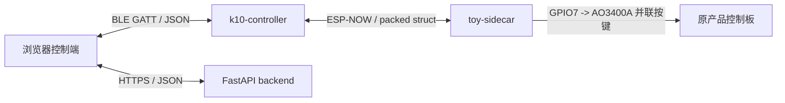

# protocol —— 三端唯一事实来源

固件、App、后端的所有字段、枚举、阈值都从 [`contract.yaml`](contract.yaml) 生成。
这一层的存在意义只有一个：**三端不许各写各的**。

## 改协议的唯一流程

```bash
# 1. 改 contract.yaml
# 2. 重新生成
python3 tools/gen.py
# 3. 提交 contract.yaml + generated/ + schemas/ 的全部变更
```

CI / 提交前自检：

```bash
python3 tools/gen.py --check   # 产物与契约不一致则退出码 1
```

`generated/` 与 `schemas/` **进版本库**，这样固件在没有 Python 的机器上也能直接编译。
它们**禁止手改**，下一次生成会覆盖。

`tools/gen.py` 不依赖第三方库；装了 PyYAML 就用 PyYAML，没装则用内置的受限 YAML 子集解析器。
读写一律显式 UTF-8、换行一律 LF，所以 Windows 中文环境下也能直接跑。

## 三条链路



| 链路 | 编码 | 契约文件 |
|---|---|---|
| App ↔ K10 | JSON over BLE GATT | [`ble_gatt.md`](ble_gatt.md)、`schemas/ble_uplink.json`、`schemas/ble_downlink.json` |
| K10 ↔ 玩具侧 | 定长 packed struct over ESP-NOW | [`espnow_frame.md`](espnow_frame.md)、`generated/nascent_protocol.h` |
| App ↔ 后端 | JSON over HTTPS | `schemas/cloud_summary.json`、`schemas/cloud_action.json` |
| App 本地归档 | SQLCipher | `schemas/session_record.json` |

## 产物去向

| 生成物 | 消费方 | 接法 |
|---|---|---|
| `generated/nascent_protocol.h` | 两个固件工程 | `build_flags = -I../../protocol/generated` |
| `generated/protocol.dart` | 对照用 | 仍生成，控制端不再消费 |
| `generated/protocol.js` | 浏览器控制端 | 构建前拷贝到 `software/app/js/protocol.js` |
| `generated/protocol.py` | FastAPI 后端 | 构建前拷贝到 `software/backend/app/protocol.py` |
| `schemas/*.json` | 联调与契约测试 | 任意 JSON Schema 校验器 |

## 版本策略

当前 `0.1.0-demo`。

- **major** 变更 = 线上不兼容。固件 `nl_wire_header_valid()` 只校验 major，major 不同直接丢包。
- **minor** 变更 = 向后兼容的字段追加。
- `-demo` 后缀表示这是验证期双板形态，不是量产形态。

### demo 与量产的差异（重要）

技术文档里的 BLE 上行契约是**量产形态**：单板 ESP32 直连手机、双 NTC 接触测温。
验证期是双板，传感器在玩具侧、BLE 在 K10，中间隔着 ESP-NOW。为了让量产字段名不被推翻：

- `temp_a` / `temp_b` 保留字段名，声明为 nullable，**demo 阶段恒为 `null`**（wire 上是 `SENTINEL_I16`）。
- 新增 `env_temp` / `env_humidity` 承载 DHT11。
- **DHT11 不是安全通道。** 它最快 1 Hz（`DHT11_MIN_INTERVAL_MS`），不能用于接触面过温熔断。
  熔断在量产要靠 12 Hz 的接触 NTC，demo 阶段尚未焊。任何用 `env_temp` 做熔断的代码都是 bug。

## 两条固化的安全约定

1. **枚举 0 号一律是最安全的取值。** 一帧全零的坏包解出来是 `stop` / `unknown` / `none`，不是加档。
2. **档位只能经 `nl_clamp_level()` 落地。** 云端自由文本永远不能直转设备指令，
   App 侧的安全总督与固件侧的封顶是两道独立的关，任何一道都不得省略。
